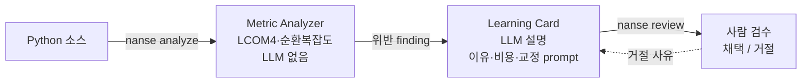

# NaN-SE

[](https://github.com/YujunOh/NaN-SE/actions/workflows/ci.yml)

> AI가 만든 코드의 **응집도·복잡도 위반을 결정론적으로 검출**하고, 그 위반을 **학습 카드로 설명**한다. 검출은 LLM을 쓰지 않아 흔들리지 않고, 판정은 사람이 한다.

### 이름의 뜻

`NaN`은 부동소수점 연산의 그 **Not a Number**다. 계산이 어딘가 잘못됐을 때 조용히 번져 나가는 값이다. AI가 빠르게 찍어내는 코드도 돌아가는 듯 보이지만 설계가 어긋난 채 퍼진다는 점에서 같다. 동시에 `NaN-SE`는 **Not a Naive Software Engineer**, 순진하게 짠 코드를 잡아내겠다는 말장난이다. 뒤의 `SE`는 Software Engineering이다.

AI coding agent는 *무엇을 만들지* 정한다. NaN-SE는 그 결과물이 설계 원칙을 지키는지 결정론적 정적 메트릭으로 검출하고, 확정된 위반을 학습 카드로 설명해 사용자가 직접 고칠지 판단하게 한다. 검출은 LLM을 쓰지 않아 같은 코드에 항상 같은 결과가 나오고, LLM은 점수를 매기지 않고 설명만 한다.

### 왜 SRP와 OCP만 검출하나

의도된 범위 결정이다. **같은 코드에 항상 같은 판정이 나오도록 기계적으로 측정 가능한 위반만** 검출한다. LCOM4는 클래스 응집 결손을 세어 SRP 위반 신호를, 순환복잡도는 분기 폭증을 세어 OCP 위반 신호를 준다. 둘 다 결정론적이다. 반면 LSP·ISP·DIP나 결합도 일부는 기계 판정이 어렵거나 확률적 점수가 필요한데, 그걸 LLM에 맡기면 같은 코드도 매번 다른 점수가 나온다. 신뢰할 수 없다고 보고 검출 대상에서 뺐다. 적게 잡더라도 흔들리지 않는 쪽을 택했다. (근거 연구 "Are We SOLID Yet?", 경위는 [docs/DISCUSSION_LOG.md](./docs/DISCUSSION_LOG.md) Day 5)

### 이 저장소를 읽는 순서 (SW공학 프로세스 흐름)

요구분석에서 형상관리까지 개발 단계 순서대로 따라가면 된다. 각 단계의 산출물이 어디 있는지 정리한다.

| 단계 | 산출물 · 어디서 보나 |
|---|---|
| 1. 요구분석 | [REQUIREMENTS.md](./docs/REQUIREMENTS.md) — 페르소나·5W1H 페인포인트·유스케이스 다이어그램(include/extend)·비기능 요구·신뢰성 요구 |
| 2. 설계 (UML) | [ARCHITECTURE.md](./docs/ARCHITECTURE.md) — 클래스 다이어그램·as-built 구조·ER 스키마, 그리고 REQUIREMENTS의 worst-case 시퀀스 다이어그램 |
| 3. 구현 | 아래 **빠른 시작** + **동작 모습**. 컨테이너 실행은 `Dockerfile`·`docker-compose.yml` |
| 4. 테스트 | 아래 **테스트 실행**(pytest 36: 단위·통합·회귀·스모크) + CI([`.github/workflows/ci.yml`])가 커밋마다 자동 검증 |
| 5. 형상관리·프로세스 | 커밋 이력 + [DISCUSSION_LOG.md](./docs/DISCUSSION_LOG.md)(일자별 결정·피벗) + `.github` 이슈/PR 템플릿 |
| 6. 과제 평가 | [REPORT.md](./docs/REPORT.md) — 위 전 과정의 프로세스 적용과 lessons learned |

배경·컨셉은 [VISION.md](./docs/VISION.md), 지표 정의는 [METRICS.md](./docs/METRICS.md). 나머지(COMPETITIVE·INTERFACES·LECTURE_COVERAGE·WBS·EV_LOG·AI_USAGE)는 주제별 참조.

## 빠른 시작

API 키 없이 검출·검수 흐름을 바로 볼 수 있다. 예시 데이터를 채우고 대시보드를 띄운다.

```bash
# 1. 설치 (Python 3.11+)
pip install -e ".[api]"

# 2. 예시 finding·학습 카드 채우기 (API 키 불필요)
nanse seed-demo

# 3. 읽기 API 서버
nanse serve                      # http://127.0.0.1:8000

# 4. 대시보드 (다른 터미널에서)
cd web && npm install && npm run dev   # http://localhost:5173
```

실제 코드를 분석하려면:

```bash
nanse analyze examples/auth_service.py   # 결정론적 검출만 (LLM 없음, LCOM4=3 SRP 위반 출력)

export ANTHROPIC_API_KEY=sk-...          # 학습 카드 생성에만 필요
nanse learn examples/auth_service.py     # 위반을 학습 카드로 설명
nanse cards                              # 미검수 카드 목록
nanse review CARD-001                    # 카드 한 장을 띄워 채택/거절
nanse trace                              # 요구(UC)↔코드↔테스트 추적 매트릭스 + gap
```

## 테스트 실행

검출·요구 추적·통합 흐름을 회귀 검증하는 pytest 36개가 있다. 저장소 루트에서 바로 돌릴 수 있다.

```bash
pip install -e ".[dev]"   # pytest 설치 (이미 .[api]를 깔았다면 pytest만 추가됨)
python -m pytest -q
```

기대 출력은 `36 passed`다. 커버 범위는 다음과 같다.

| 파일 | 검증 대상 |
|---|---|
| `tests/test_lcom.py` | LCOM4 계산 (정상·god class·메서드 호출 연결·staticmethod 제외·빈 클래스·잘못된 입력 예외·클래스 없음·타입) |
| `tests/test_complexity.py` | radon 순환복잡도 검출과 임계 매핑 |
| `tests/test_traceability.py` | REQ↔UC↔코드↔테스트 존재 검증과 gap 분류(complete·no_code·no_test) |
| `tests/test_integration.py` | 검출 → 카드 생성 → 저장 → 검수 end-to-end (가짜 LLM 주입) |
| `tests/test_learning_card.py` | 학습 카드 파이프라인 (가짜 LLM 주입으로 네트워크 없이 검증) |
| `tests/test_store.py` | SQLite 저장·조회·검수 상태 |
| `tests/test_smoke.py` | 예시 분석이 끝까지 도는지 1차 점검 |
| `tests/test_regression.py` | god class LCOM4=3 고정 (생성자 버그 재발 가드) |

검출은 결정론적이라 같은 코드에 항상 같은 값이 나오므로 `assert ==`로 값을 고정해 검증한다.

### 컨테이너로 실행

```bash
docker compose up --build      # 읽기 API → http://localhost:8000
docker run --rm nanse:latest nanse analyze examples/auth_service.py
```

## 동작 모습

파이프라인은 한 방향이다. 검출은 LLM 없이 결정론적으로, 설명만 LLM이, 검수는 사람이 한다.



`nanse analyze`는 검출만 단독으로 돈다. 같은 코드에는 항상 같은 결과가 나온다.

```
        메트릭: auth_service.py
┌─────────────┬───────┬────────┬───────┐
│ 클래스      │ LCOM4 │ 메서드 │ 응집  │
├─────────────┼───────┼────────┼───────┤
│ AuthService │     3 │      5 │ 분리? │
│ Counter     │     1 │      2 │  OK   │
└─────────────┴───────┴────────┴───────┘
                            위반 finding
┌─────────────┬───────────────────┬───────┬─────────┬──────┬────────┐
│ 대상        │ 위치              │ 지표  │ 값/임계 │ 원칙 │ 심각도 │
├─────────────┼───────────────────┼───────┼─────────┼──────┼────────┤
│ AuthService │ auth_service.py:8 │ lcom4 │  3 / 1  │ SRP  │      6 │
└─────────────┴───────────────────┴───────┴─────────┴──────┴────────┘
```

`nanse serve` + 웹 대시보드로 검출·검수 현황을 본다 (`nanse seed-demo` 예시 데이터).


## 왜 지금 필요한가: "AI 스파게티"와 "공장 컨베이어벨트"

바이브코딩은 트렌드를 넘어 개발의 기본 모드가 되었지만, 같은 기간 소프트웨어 품질은 두 가지 비유로 표현될 만큼 나빠졌다.

- **"AI 스파게티"**: 기능은 동작하지만 서로 한 번도 만나본 적 없는 사람 여럿이 따로 짠 것 같은 코드베이스다. 매 커밋마다 기술부채가 쌓이고, 평소엔 멀쩡하다 어느 순간 통째로 무너진다.
- **"공장 컨베이어벨트"**: 손길이 거의 닿지 않은 채 라인 끝에서 쏟아져 나오는 양산형 제품이다. 빠르고 많이 나오지만 출하 전 검수가 빠지면 반품과 재작업 비용으로 돌아온다.

CodeRabbit 조사(2025)는 AI 생성 코드의 정량적 차이를 보여준다. 버그 1.7배, 보안 취약성 2배, 논리 오류 75%다. 한 시장 분석은 2027년까지 AI 생성 코드에서 누적 약 $1.5T 기술부채를 예측한다. 단순한 도구 사용 미숙으로 보기 어렵고, 소프트웨어 위기가 새 형태로 돌아온 것에 가깝다.

자세한 배경·통계·비전은 [docs/VISION.md](./docs/VISION.md)

## 문제 정의

AI coding agent를 쓰는 개발 흐름의 흔한 패턴은 이렇다.

```
자연어 지시
  → AI가 요구사항을 자기 마음대로 해석
  → 설계 단계 건너뛰고 곧장 구현
  → 테스트는 형식적으로 같이 생성
  → 문서는 누락
  → 변경 영향 분석 없음
  → 코드가 돌아가면 종료
```

겉으로는 빠르게 끝난 것 같지만, 실제로는 다음이 누적된다.

- **토큰 낭비** — AI가 추측성 기능·미래 대비 추상화를 만들면 사용자가 다시 지우는 데 또 토큰을 쓴다. 같은 작업을 두 번 결제한 셈
- **시간 낭비** — 빨리 끝난 줄 알았던 작업이 며칠 뒤 디버깅 비용으로 돌아온다. "AI 코드 디버깅이 직접 코딩보다 오래 걸렸다"는 응답이 개발자 45%대 (Stack Overflow Survey 2025)
- **자원 낭비** — 어차피 해야 할 작업(요구 정리·설계·테스트·문서)이 뒤로 미뤄지며 기술부채가 누적된다. 사람이 손 안 댄 단계들이 쌓이면 다른 사람이 손 댈 수도 없는 상태로 변한다
- **검증 누락** — 코드가 돌아가는 것과 요구를 만족하는 것은 다른 문제다. V&V를 한 번도 거치지 않은 산출물이 그대로 main에 들어가는 일이 일상화된다
- **버그·보안 결함의 정량 차이** — CodeRabbit 조사(2025) 기준 AI 생성 코드는 직접 작성 대비 버그 1.7배, 보안 취약성 2배로 검출됨. 논리 오류율은 75% 수준. "코드가 돌아간다"와 "안전하게 쓸 수 있다"는 다른 문제이고, 그 차이를 직접 검증하지 않으면 운영 단계에서 비용으로 돌아온다

기존 도구들(SonarQube, Helicone, LangSmith 등)은 코드 작성 이후의 정적 분석이나 LLM 비용 추적에 집중되어 있고, AI가 코드를 만드는 과정 자체에 SW공학 절차를 끼워넣는 도구는 빈자리로 남아있다.

NaN-SE는 이 빈자리에 들어가는 미들웨어다. AI coding agent를 대체하는 도구가 아니라, agent가 만든 산출물의 SRP·응집도 위반을 결정론적 정적 메트릭(LCOM4·순환복잡도)으로 검출하고, 확정된 위반을 LLM이 학습 카드로 설명해 사용자가 검수하게 한다. 검출과 설명을 분리한 게 핵심이다. 점수 매기기는 LLM에 맡기지 않는다.

## 핵심 아이디어 — 검출과 설명을 분리한다

NaN-SE의 핵심은 위반을 *찾는 일*과 *설명하는 일*을 다른 층으로 나눈 것이다.

- **검출은 결정론적 정적 메트릭이 한다.** LCOM4(연결 요소 수)로 응집 결손(SRP)을, radon 순환복잡도로 분기 폭증을 측정한다. LLM을 쓰지 않으므로 같은 코드는 항상 같은 결과를 낸다. 평가가 흔들리지 않는다.
- **설명은 LLM이 한다.** 확정된 위반만 학습 카드로 넘긴다. 카드는 위반 이유, 운영 단계 비용, Before/After 코드, AI에 다시 보낼 수정 prompt를 담는다. 점수는 매기지 않는다.

이 분리가 설계 전체의 기준이다. 처음에는 LLM이 SOLID 위반을 점수로 매기는 구조였지만, 같은 코드를 같은 프롬프트로 두 번 점수를 매겨도 점수가 흔들렸다. 신뢰성 요구를 위반하므로 검출을 결정론적 메트릭으로 옮기고 LLM은 설명만 맡게 했다. 경위는 [docs/DISCUSSION_LOG.md](./docs/DISCUSSION_LOG.md) Day 5.

## 모듈과 구현 범위

Day 5 피벗으로 실제 구현은 검출과 설명에 집중하고, 요구 추적(Traceability)은 최소 한 줄기만 구현했다. 나머지는 설계로 남겼다.

### 구현

| 모듈 | 역할 |
|---|---|
| **Metric Analyzer** (구현) | AI 생성 코드를 결정론적 정적 메트릭으로 검출. LCOM4 직접 구현으로 SRP·응집도 위반을, radon으로 순환복잡도를 검출. LLM을 쓰지 않아 동일 코드는 항상 동일 결과 |
| **Learning Card** (구현) | 확정된 위반을 LLM이 학습 카드로 설명 (위반 이유·운영 단계 비용 예시·Before/After 코드·재요청 prompt). 점수는 매기지 않고 설명만. 사용자 검수 후 AI에 다시 전달하는 폐쇄 루프 |
| **Traceability** (부분 구현) | `nanse trace`로 요구(UC)↔코드↔테스트 존재를 결정론적으로 검증하고 gap(complete·no_code·no_test)을 분류. 명세는 `traceability.toml`. 전체 설계(commit 태그 자동 갱신·Mermaid export)는 미구현 |

### 설계만 (코드 없음)

아래는 초기 구상이고 이번 prototype 범위에서 구현하지 않았다. 보고서·문서에 설계로만 남긴다.

| 모듈 | 범위 |
|---|---|
| Stage | SDLC 5단계 누락 검출 + 제안 (차단하지 않는 방식). 설계만 |
| EV Tracker / FP Counter / Process Log | EV(PMBOK)·FP(IFPUG)·ISO 25010 매핑. 설계만 |

## 기존 도구와의 위치

| 도구 | 무대 | NaN-SE와의 관계 |
|---|---|---|
| Claude Code, GPT (OpenAI), Cursor, Gemini, 자체 LLM | AI coding agent 실행 | NaN-SE는 agent 산출물을 검증하는 별도 레이어 (현재는 CLI, hook 통합은 설계 방향) |
| LangChain, LangGraph, 자체 에이전트 프레임워크 | 에이전트 실행 인프라 | NaN-SE는 그 위의 정책 레이어 |
| SonarQube, ESLint, radon | 정적 분석·메트릭 검출 | 검출 자체는 겹친다. NaN-SE의 차별점은 검출 뒤 LLM 학습 카드로 설명하고 사람이 검수하는 흐름 |
| LangSmith, Helicone | LLM 비용·레이턴시 observability | 측정 대상이 다름. NaN-SE는 SW공학 절차 준수 |

NaN-SE는 하나의 벤더(Claude, GPT, Gemini, 자체 LLM)에 종속되지 않는다. hook 인터페이스만 표준화되면 다른 벤더로도 어댑터를 통해 확장 가능한 구조다.

자세한 비교는 [docs/COMPETITIVE.md](./docs/COMPETITIVE.md)

## 핵심 정책 — 검수는 사람이 한다

검증(Verification)과 확인(Validation)은 결국 사람이 한다는 점이 핵심. 검출은 결정론적이지만 위반을 고칠지, 학습 카드의 교정 예시를 받아들일지는 사용자가 정한다.

- Metric Analyzer가 위반을 검출해도 고칠지는 사용자 판단
- 학습 카드는 LLM이 생성한 설명이므로 사용자가 검수·채택. 거절 사유는 다음 카드 생성 시 prompt 개선에 반영
- Stage는 차단하지 않고 검출·제안만. 우회 명령 불필요
- Traceability 매트릭스 자동 매핑 결과를 사용자가 한 번 확인 후 채택

자세한 정책은 [docs/AI_TOOLING.md](./docs/AI_TOOLING.md), [docs/REQUIREMENTS.md](./docs/REQUIREMENTS.md)

## 기술 스택

- Python 3.11+
- radon (순환복잡도), 자체 구현 LCOM4 (검출)
- Anthropic SDK (학습 카드 설명 생성, Haiku)
- SQLite (finding·학습 카드·검수 상태)
- CLI: Typer + rich
- 대시보드: FastAPI + uvicorn (읽기 API), Vite + React + recharts (web)
- 다이어그램: Mermaid

Claude Code hook 통합(`PreToolUse`, `Stop`, `UserPromptSubmit`)으로 코드 작성 직후 inline 검출하는 구조는 설계 방향이며 이번 범위에서 구현하지 않았다.

## 문서 인덱스

| 문서 | 내용 |
|---|---|
| [VISION](./docs/VISION.md) | 비전·배경·TCP 비유·로드맵 |
| [ARCHITECTURE](./docs/ARCHITECTURE.md) | 4 핵심 모듈 + 옵션, SQLite 스키마, CLI 명령 체계 |
| [LEARNING_CARDS](./docs/LEARNING_CARDS.md) | 학습 카드 시스템 — 데이터 모델, 생성 파이프라인, 본인 구현 vs LLM 영역 |
| [INTERFACES](./docs/INTERFACES.md) | Protocol 기반 모듈 contract |
| [REQUIREMENTS](./docs/REQUIREMENTS.md) | 페르소나, 5W1H 페인포인트, 유스케이스, V&V 정책 |
| [WBS](./docs/WBS.md) | 12일 일정 + 트랙 구조 |
| [METRICS](./docs/METRICS.md) | FP / EV / ISO 25010 정의·공식 (옵션 모듈) |
| [COMPETITIVE](./docs/COMPETITIVE.md) | 기존 도구 비교 (CodeRabbit, traceability-check 등) |
| [DISCUSSION_LOG](./docs/DISCUSSION_LOG.md) | 일별 자연어 토의·의사결정 일지 |
| [AI_TOOLING](./docs/AI_TOOLING.md) | AI 도구 선정 근거 |
| [AI_USAGE](./docs/AI_USAGE.md) | AI 사용 일지 |
| [EV_LOG](./docs/EV_LOG.md) | 일별 EV 측정 |

## 작성자

오유준 (홍익대학교 컴퓨터공학과)
