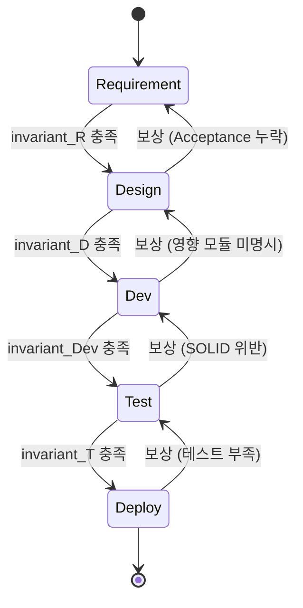
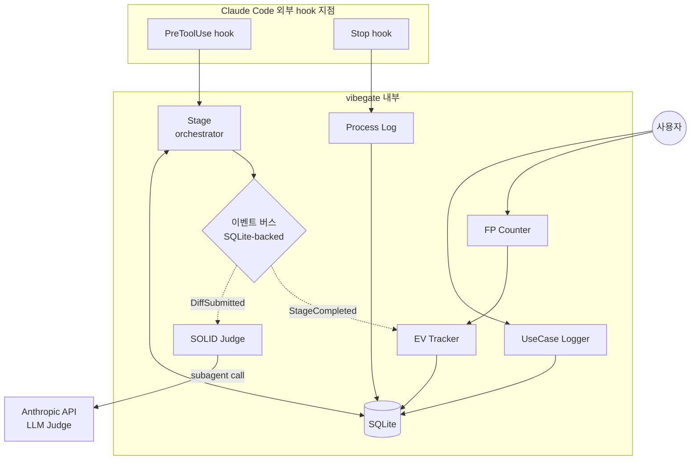
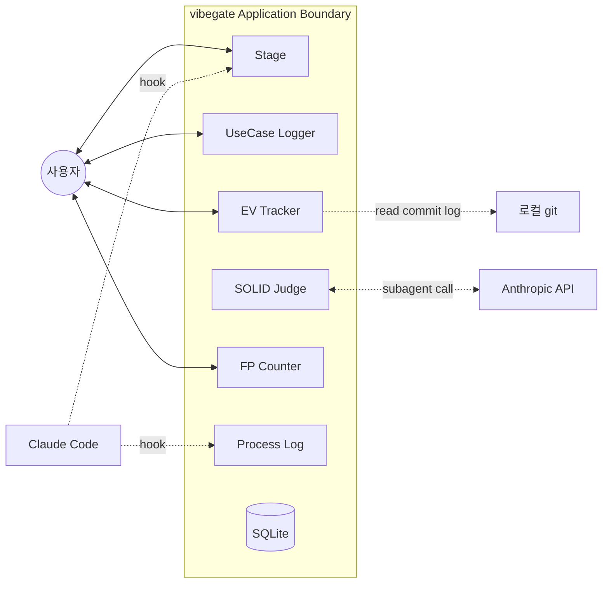

# Architecture — vibegate (Day 3 초안)

> Day 3 작업물. INTERFACES.md, Hook PoC 결과는 이 문서를 후속 수정한다.

## 0. 한 줄 요약

6 모듈 + 5 Stage SAGA + hybrid (orchestration: 핵심 4 / choreography: 보조 2) + SQLite 단일 store + LLM judge subagent.

## 1. 5 Stage (SAGA 패턴)

vibegate의 5 Stage는 SDLC를 SAGA로 모델링한 결과. 각 Stage는 독립 트랜잭션이며, invariant를 만족해야 다음 Stage 진입 가능. 실패 시 보상 트랜잭션으로 이전 Stage로 rollback.

SAGA 패턴 자체는 1987년 분산 시스템 논문에서 정립된 것이고, 긴 트랜잭션을 잘게 잘라 독립 단위로 수행하면서 단계 간 ordering constraint(예: 결제 확인 후에만 배송 시작)를 두는 발상이 핵심. vibegate가 새로 만든 패턴이 아니라 SDLC 도메인으로 옮긴 응용에 해당하는 위치.

| Stage | invariant (진입 조건) | 보상 트랜잭션 (실패 시) |
|---|---|---|
| 1. Requirement | (없음, 시작 stage) | — |
| 2. Design | Requirement 1개 이상 등록 + Acceptance Criteria 명시 | Stage 1로 복귀, 누락 항목 알림 |
| 3. Dev | Design 문서 등록 + 영향 모듈 명시 | Stage 2로 복귀 |
| 4. Test | diff가 SOLID Judge 통과 (점수 ≥ threshold) | Stage 3로 복귀, 재요청 |
| 5. Deploy | 테스트 케이스 ≥ Acceptance Criteria 수 | Stage 4로 복귀 |



메모: 분산 시스템에서 흔히 인용되는 SOA SAGA 예시(주문 → 결제 → 재고 → 배송)는 비즈니스 트랜잭션 영역. vibegate의 5 Stage는 SDLC 프로세스 영역. 도메인이 다른데 같은 패턴이 적용되는 것이 SAGA의 일반성

## 2. Choreography vs Orchestration — Hybrid 결정

SOA·마이크로서비스 영역에서 모듈 간 통신 방식은 크게 두 가지로 분류된다.

- **Choreography**: 각 모듈이 자율적으로 이벤트를 발행·구독. 중앙 조정자 없음. 결합도 낮지만 흐름 추적 어려움
- **Orchestration**: 중앙 조정자가 모듈 호출 순서 관리. 흐름 명확하지만 조정자가 단일 중단점(SPOF)

순수 choreography로 가면 6 모듈이 모두 이벤트 구독·발행. 디버깅 + state machine 추적 어려움. 순수 orchestration이면 Stage가 SPOF.

**결정**: hybrid.

| 모듈 | 통신 방식 | 이유 |
|---|---|---|
| Stage | orchestration 중심 (state machine 관리) | 5 Stage SAGA의 중앙 조정자 역할 |
| Process Log | orchestration (Stage가 호출) | trace state 공유 |
| SOLID Judge | choreography (DiffSubmitted 이벤트 구독) | 독립 검증, Stage가 결과만 받음 |
| UseCase Logger | choreography (사용자 직접 호출 + Stage 참조) | 사용자 입력 시점이 Stage와 무관 |
| EV Tracker | choreography (StageCompleted 이벤트 구독) | 진척 측정은 비동기로 충분 |
| FP Counter | choreography (사용자 입력 + EV Tracker가 polling) | 입력 시점 무관 |

→ Stage가 "최소 orchestration" 역할, 나머지는 choreography. 중앙 조정자 부하 분산 + 흐름 추적성을 절충한 결과

## 3. 모듈 구조 다이어그램



이벤트 버스는 Day 4 구현에서 SQLite의 `events` 테이블로 시작. Future Work에서 publish/subscribe 미들웨어로 분리 가능.

## 4. SQLite 스키마 초안

```sql
-- 세션 메타
CREATE TABLE sessions (
    id TEXT PRIMARY KEY,
    project_path TEXT NOT NULL,
    started_at TIMESTAMP NOT NULL,
    ended_at TIMESTAMP
);

-- 5 Stage state machine
CREATE TABLE stages (
    id INTEGER PRIMARY KEY,
    session_id TEXT REFERENCES sessions(id),
    stage_name TEXT CHECK(stage_name IN ('Requirement','Design','Dev','Test','Deploy')),
    entered_at TIMESTAMP NOT NULL,
    invariant_satisfied INTEGER DEFAULT 0,  -- bool
    rollback_count INTEGER DEFAULT 0
);

-- 요구사항 & 유스케이스
CREATE TABLE requirements (
    id TEXT PRIMARY KEY,  -- REQ-001 형식
    session_id TEXT REFERENCES sessions(id),
    title TEXT NOT NULL,
    kind TEXT CHECK(kind IN ('functional','non_functional')),
    acceptance_criteria TEXT  -- JSON array
);

CREATE TABLE usecases (
    id TEXT PRIMARY KEY,  -- UC-001
    session_id TEXT REFERENCES sessions(id),
    actor TEXT NOT NULL,
    scenario TEXT NOT NULL,
    mermaid TEXT,  -- 자동 생성된 다이어그램
    include_uc_ids TEXT  -- JSON array of UC IDs
);

-- SOLID 채점 결과
CREATE TABLE solid_judgments (
    id INTEGER PRIMARY KEY,
    session_id TEXT REFERENCES sessions(id),
    diff_hash TEXT NOT NULL,
    srp_score INTEGER, ocp_score INTEGER, lsp_score INTEGER,
    isp_score INTEGER, dip_score INTEGER,
    cohesion_score INTEGER, coupling_score INTEGER,
    judged_at TIMESTAMP,
    user_accepted INTEGER  -- 사용자 최종 채택 여부 (검수는 사람)
);

-- WBS / EV
CREATE TABLE wbs_tasks (
    id TEXT PRIMARY KEY,
    session_id TEXT REFERENCES sessions(id),
    title TEXT NOT NULL,
    planned_value REAL,
    earned_value REAL DEFAULT 0,
    actual_cost REAL DEFAULT 0
);

-- FP
CREATE TABLE fp_items (
    id INTEGER PRIMARY KEY,
    session_id TEXT REFERENCES sessions(id),
    kind TEXT CHECK(kind IN ('EI','EO','EQ','ILF','EIF')),
    complexity TEXT CHECK(complexity IN ('low','avg','high')),
    weight REAL NOT NULL
);

-- transcript 분류 (Process Log)
CREATE TABLE transcripts (
    id INTEGER PRIMARY KEY,
    session_id TEXT REFERENCES sessions(id),
    captured_at TIMESTAMP,
    stage_classified TEXT,
    iso25010_dimension TEXT  -- 기능성/신뢰성/사용성/효율성/유지보수성/이식성
);

-- 강제 우회 로그 ("검수는 사람" 정책)
CREATE TABLE force_overrides (
    id INTEGER PRIMARY KEY,
    session_id TEXT REFERENCES sessions(id),
    stage_name TEXT,
    reason TEXT NOT NULL,
    forced_at TIMESTAMP
);

-- 이벤트 버스 (choreography)
CREATE TABLE events (
    id INTEGER PRIMARY KEY,
    session_id TEXT REFERENCES sessions(id),
    event_type TEXT NOT NULL,  -- DiffSubmitted, StageCompleted, ...
    payload TEXT,  -- JSON
    published_at TIMESTAMP,
    consumed_by TEXT  -- JSON array of module names
);
```

WAL 모드 활성화 (`PRAGMA journal_mode=WAL`). hook과 모듈 간 메모리 가시성·일관성 보장 위함.

## 5. CLI 명령 체계

```
vibegate init                          # 현재 디렉토리에 .vibegate/ 생성, SQLite 초기화
vibegate session start                 # 새 세션 시작 (Stage=Requirement)
vibegate session status                # 현재 stage, EV, 진척률
vibegate session end                   # Stop hook이 자동 호출, 수동도 가능

vibegate req add <title> <kind>        # 요구사항 추가, REQ-NNN 부여
vibegate req list

vibegate usecase add <markdown_file>   # UC-NNN 부여, Mermaid 자동 생성
vibegate usecase list

vibegate wbs add <title> <pv>          # WBS task 추가
vibegate wbs ev                        # EV 계산 및 출력

vibegate fp add <kind> <complexity>    # FP 항목 추가
vibegate fp calc                       # FP 합계

vibegate report                        # Process Log 단계별 비율 + ISO 25010 매핑

vibegate force --reason "..."          # Stage 우회 (사유 필수)
```

## 6. Application Boundary

SW공학에서 application boundary는 시스템이 다루는 영역과 외부 액터·의존성을 분리하는 경계선. vibegate의 경계:



**내부**: 6 모듈 + SQLite + LLM judge prompt.
**외부**: 사용자 + Claude Code agent + Anthropic API + git.

LLM judge subagent는 *호출은 내부*, *실행은 외부 (Anthropic API)*. WC-04 (SQLite 손상)에서 외부 의존성 고려 시 이 경계가 보안·무결성 분석 기준이 됨.

## 7. 위험 대응 (REQUIREMENTS Section 5 worst-case와 매핑)

| WC | 대응 위치 | 메커니즘 |
|---|---|---|
| WC-01: hook 우회 | Stage | `Edit`/`Write`/`MultiEdit`/`NotebookEdit` + `Bash` 파일 수정 패턴까지 `PreToolUse` 등록. Day 3 PoC에서 검증. 한계: shell metacharacter로 우회 가능 → 100% 차단 불가, 보고서에 명시. |
| WC-02: LLM judge 환각 | SOLID Judge | 재요청 최대 3회 → 초과 시 `force_overrides`에 마킹하고 사용자에게 ruling. |
| WC-03: hook timeout | Stage | SQLite WAL + 동기 쓰기. 500ms 이내 응답. timeout 시 default-allow (안전 fallback). |
| WC-04: SQLite 손상 | 전체 | 매일 VACUUM + `.bak` dump. 손상 감지 시 자동 복구 시도. |
| WC-05: FP invalid 입력 | FP Counter | Pydantic validation, EV Tracker는 FP ≥ 0 contract. |

## 8. 설계 메모

설계하면서 짚어둘 두 가지:

1. **5 Stage가 너무 워터폴 같지 않나** - 애자일 모델은 stage 경계가 흐린 편. vibegate가 워터폴을 강제하는 모양새이지만, 실제로는 한 세션 안에서 Stage 1↔2↔3 사이를 왔다갔다 할 수 있는 구조(보상 트랜잭션). 즉 애자일 스프린트 안의 SAGA에 가까운 형태. 보고서에 명시할 예정인 부분

2. **choreography 부분이 진짜 choreography인가** - SQLite `events` 테이블 polling으로 시작하는 구조라 엄격한 pub/sub은 아닌 상태. "poor man's choreography" 수준임을 정직하게 적어둠. FUTURE_WORK Section 1에서 진짜 pub/sub 미들웨어로 분리하는 것이 다음 단계

ARCHITECTURE는 구현 단계 들어가면서 계속 수정될 가능성 있음. 이 문서가 최종본이 아닌 상태
