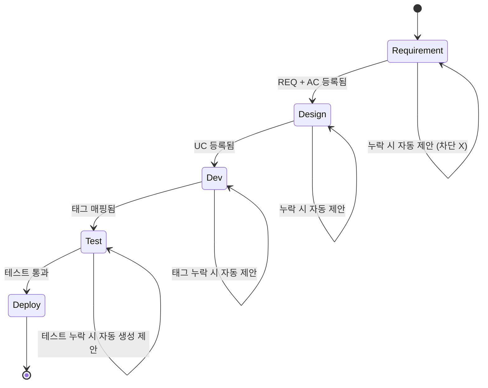
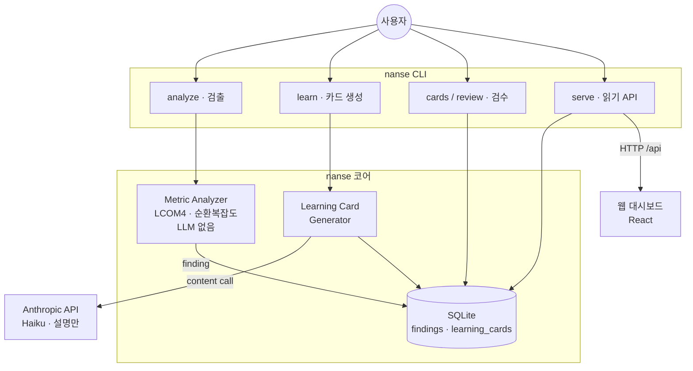
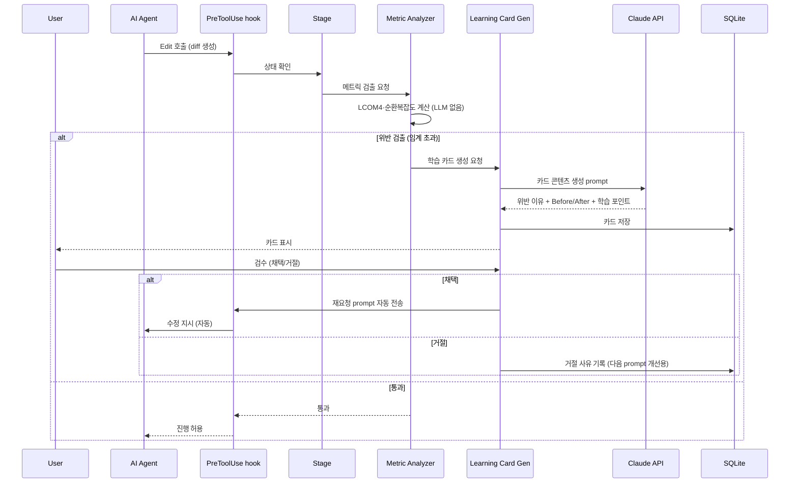
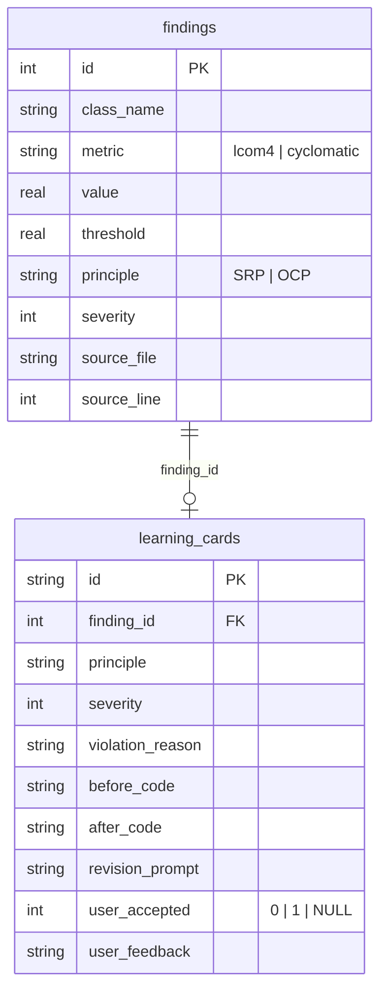

# Architecture: NaN-SE

> **피벗 반영(Day 5)**: LLM 채점(SOLID Judge)을 폐기하고 결정론적 검출(Metric Analyzer: LCOM4, 순환복잡도)과 LLM 설명(Learning Card)으로 분리했다. 아래 다이어그램·표의 옛 "SOLID Judge" 노드는 검출층 Metric Analyzer로 읽는다. 검출은 LLM을 쓰지 않으므로 "LLM judge subagent"는 LLM 설명층 호출로 정정한다. 경위는 DISCUSSION_LOG.md Day 5.
>
> **구현 범위 (정직 표기)**: 실제 코드(`nanse/`)에 있는 것은 검출(`metrics/`: lcom·complexity·findings) + 설명(`learning_card/`) + 저장(`db/`) + 읽기 API(`api/`) + CLI + 웹 UI다. 아래 1·2절의 5 Stage(SAGA), EV Tracker, FP Counter, Process Log, Choreography 이벤트 버스는 피벗 때 접은 원설계이고 코드로 구현하지 않았다. 이 절들은 설계 사고 기록으로 읽고, 도구 기능으로 오해하지 않도록 한다. 실제 동작 지표 정의는 METRICS.md를 따른다.

## 0. 한 줄 요약

구현된 것: 핵심 폐루프(Metric Analyzer 검출 + Learning Card 설명) + SQLite 단일 store(findings·learning_cards 2테이블) + 읽기 API + 웹 대시보드 + CLI. 설계로만 남은 것: Claude Code Hook 통합, 5 Stage, Traceability, Progress Dashboard 모듈, EV/FP/Process Log.

## 1. 5 Stage (SAGA에서 빌린 느슨한 비유 — 미구현)

> 정직하게 적는다. 아래 SAGA 적용은 설계 단계의 비유일 뿐이고 Stage는 구현하지 않았다(0절). 비유 자체도 느슨하다. SAGA는 분산 트랜잭션의 데이터 일관성을 보상 트랜잭션으로 지키는 패턴인데, SDLC 단계는 분산 트랜잭션이 아니고 되돌릴 커밋 상태도 없다. "긴 작업을 독립 단위로 잘라 단계 간 순서 조건을 둔다"는 표면만 빌렸을 뿐, SAGA의 핵심인 보상 트랜잭션과 일관성 보장과는 거리가 있다. 강의에서 다룬 패턴에 맞춰 보려다 끼워맞춘 면이 있었음을 인정하고, 여기서는 "이렇게 빗대 구상했다"는 기록으로만 남긴다.

원래 구상은 SDLC 5단계(요구→설계→구현→테스트→배포)를 SAGA에 빗대, 각 단계에 진입 조건을 두고 누락 시 차단 대신 알림·제안하는 것이었다. 보상 트랜잭션을 "자동 rollback"이 아니라 "누락을 알리고 자동 생성을 제안하는" 부드러운 형태로 바꿔 적용하려 했다. 실제 구현(검출·설명 폐루프)에는 트랜잭션도 단계 게이트도 없어 이 패턴이 필요하지 않았다.

| Stage | 기대 산출물 | 누락 검출 시 동작 |
|---|---|---|
| 1. Requirement | REQ-NNN 명시 + acceptance criteria | "관련 REQ ID 매핑 없음. 추가하시겠습니까?" 자동 제안 |
| 2. Design | UC-NNN 명시 + 영향 모듈 | "UC 없음. 마크다운 템플릿 자동 생성?" 제안 |
| 3. Dev | commit message에 `[REQ-NNN][UC-NNN]` 태그 | "태그 누락. 자동 매핑 후보 표시" |
| 4. Test | pytest 파일 존재 | "테스트 누락. 4종 기본 케이스 자동 생성?" 제안 |
| 5. Deploy | 통합 테스트 통과 + 문서 갱신 | "문서 drift 감지. 자동 갱신?" 제안 |



기존 SDLC 도구(claude-sdlc, agentic-sdlc, Superpowers 등)는 phase 흐름을 강제. NaN-SE는 정반대로 **부드러운 제안**만 — 사용자 의사결정 우선.

## 2. Choreography vs Orchestration — Hybrid (설계 구상, 미구현)

> 이 절도 원설계의 다중 모듈을 전제한 통신 방식 논의다. 실제 구현은 검출과 설명 두 모듈을 CLI가 직접 호출하는 단순 파이프라인이라, choreography도 orchestration도 필요하지 않았고 이벤트 버스도 없다. 아래는 모듈이 여럿이었을 때를 가정한 설계 기록이다.

SOA·마이크로서비스 영역에서 모듈 간 통신 방식은 크게 두 가지로 분류된다.

- **Choreography**: 각 모듈이 자율적으로 이벤트 발행·구독. 중앙 조정자 없음. 결합도 낮음. 흐름 추적 어려움
- **Orchestration**: 중앙 조정자가 모듈 호출 순서 관리. 흐름 명확. 단일 중단점(SPOF) 위험

NaN-SE는 4 핵심 + 3 옵션의 hybrid.

| 모듈 | 통신 방식 | 이유 |
|---|---|---|
| Metric Analyzer + Learning Card | orchestration (Stage가 호출) | 코드 변경 시점에 동기적으로 실행 필요 |
| Stage | orchestration 중심 (state machine 관리) | SDLC 진행 상태의 중앙 조정자 역할 |
| Traceability | choreography (CommitMade 이벤트 구독) | commit 발생 시점에 비동기 갱신 |
| Progress Dashboard | choreography (CardJudged 이벤트 구독) | 학습 카드 검수 결과 비동기 집계 |
| EV Tracker (옵션) | choreography (StageCompleted 구독) | 진척 측정 비동기 |
| FP Counter (옵션) | choreography (사용자 직접 호출) | 사용자 입력 시점 무관 |
| Process Log (옵션) | choreography (모든 이벤트 구독) | 전체 trace 비동기 집계 |

Stage가 "최소 orchestration" 역할, 나머지는 choreography. 중앙 조정자 부하 분산 + 흐름 추적성 절충.

## 3. 모듈 구조 다이어그램

### 3.1 원설계 전체 (대부분 설계만)

아래는 피벗 전에 그린 전체 설계다. Stage, Traceability, Progress Dashboard, EV/FP/Process Log, 이벤트 버스, Claude Code Hook 연동은 구현하지 않았다(0·1·2절 참조). 실제로 동작하는 범위는 3.2에 따로 그린다.


이벤트 버스는 초기 구현에서 SQLite의 `events` 테이블 polling으로 시작하고, Future Work에서 publish/subscribe 미들웨어(Redis Streams, NATS 등)로 분리할 수 있다.

### 3.2 구현된 것 (as-built)

실제 코드로 동작하는 부분만 추리면 다음과 같다. hook도 이벤트 버스도 Stage도 없다. `nanse` CLI가 검출과 설명을 직접 호출하고, SQLite 두 테이블에 저장하며, 읽기 API가 그 결과를 웹 대시보드에 노출한다.



## 4. Learning Card 데이터 흐름 (설계 흐름)

> 아래 다이어그램은 hook으로 코드 작성에 inline으로 붙는 원설계 흐름이다. 실제 구현에서 hook 연동과 "채택 시 AI에 자동 전송"은 없다. 사용자가 `nanse analyze`로 검출하고 `nanse learn`으로 카드를 만들고 `nanse review`로 채택·거절하는 CLI 흐름으로 동작하며, 카드의 `revision_prompt`는 사용자가 직접 AI에 붙여넣는다. 검출(Metric Analyzer)이 LLM 없이 결정론적으로 도는 부분은 실제와 같다.



LLM은 자연어 콘텐츠만 채우고, 데이터 모델·파이프라인·검수 로직·DB 저장·CLI 렌더링은 본인이 구현했다. 결과물이 "AI가 만든 것"으로 취급되지 않게 하는 것이 설계 원칙이다.

자세한 학습 카드 시스템은 [LEARNING_CARDS.md](./LEARNING_CARDS.md).

## 5. SQLite 스키마

### 5.1 실제 구현 스키마 (`nanse/db/store.py`)

피벗 후 store는 두 테이블로 단순화됐다. 검출 결과(`findings`)와 그 위반을 설명한 학습 카드(`learning_cards`)이고, 카드는 `finding_id`로 finding을 참조한다. LLM 채점 구조(`solid_judgments`)는 폐기됐으므로 점수 컬럼이 없다.

```sql
CREATE TABLE findings (
    id          INTEGER PRIMARY KEY AUTOINCREMENT,
    session_id  TEXT NOT NULL,
    class_name  TEXT NOT NULL,
    metric      TEXT NOT NULL,        -- 'lcom4' | 'cyclomatic'
    value       REAL NOT NULL,
    threshold   REAL NOT NULL,
    principle   TEXT NOT NULL,        -- 'SRP' | 'OCP'
    severity    INTEGER NOT NULL,
    source_file TEXT,
    source_line INTEGER,
    created_at  TEXT NOT NULL
);

CREATE TABLE learning_cards (
    id               TEXT PRIMARY KEY,
    session_id       TEXT NOT NULL,
    finding_id       INTEGER NOT NULL,   -- findings(id) 참조
    principle        TEXT NOT NULL,
    severity         INTEGER NOT NULL,
    code_hash        TEXT NOT NULL,
    violation_reason TEXT NOT NULL,
    cost_example     TEXT NOT NULL,
    before_code      TEXT NOT NULL,
    after_code       TEXT NOT NULL,
    learning_points  TEXT NOT NULL,
    revision_prompt  TEXT NOT NULL,
    user_accepted    INTEGER,           -- 0=거절, 1=채택, NULL=미검수
    user_feedback    TEXT,
    source_file      TEXT,
    source_line      INTEGER,
    generated_at     TEXT NOT NULL,
    reviewed_at      TEXT
);
```

두 테이블의 관계는 단순하다. 하나의 finding이 0개 또는 1개의 학습 카드를 가진다(검출은 항상 일어나지만 설명 카드는 `learn`을 돌려야 생긴다).



### 5.2 원설계 스키마 (접음, 참고용)

피벗 전 11테이블 설계다. `sessions`, `stages`, `requirements`, `usecases`, `solid_judgments`(LLM 채점), `traceability`, `dashboard_metrics`, `wbs_tasks`, `fp_items`, `transcripts`, `events`로 5 Stage·Traceability·Dashboard·EV/FP·이벤트 버스를 모두 담으려 했다. Day 5 피벗에서 검출·설명 폐루프로 범위를 좁히며 위 2테이블만 남겼다. 전체 원설계는 git 히스토리에 남아 있고, 여기서는 접은 사실만 기록한다.

## 6. CLI 명령 체계

실제 구현된 명령은 다음 6개다 (`nanse --help`로 확인).

```
nanse analyze <file>          # 결정론적 메트릭 검출 (LLM 없음)
nanse learn <file>            # 위반 finding을 학습 카드로 설명 (ANTHROPIC_API_KEY 필요)
nanse cards                   # 미검수 학습 카드 목록
nanse review <CARD-NNN>       # 카드 한 장을 띄워 채택/거절
nanse seed-demo               # API 키 없이 대시보드를 보도록 예시 데이터 채움
nanse serve                   # 읽기 API 서버 (FastAPI + uvicorn)
```

검출 → 설명 → 검수가 한 흐름이고, 검출만 LLM 없이 단독 실행할 수 있다.

아래 명령은 원설계 구상이며 구현하지 않았다(설계만).

```
nanse init / session start / session status     # Stage 모듈
nanse req add / uc add / trace / trace gaps      # Traceability 모듈
nanse dashboard                                  # Progress Dashboard (웹 대시보드가 일부 대체)
nanse ev / fp add / process-log                  # EV / FP / Process Log 옵션
```

## 7. Application Boundary

SW공학에서 application boundary는 시스템이 다루는 영역과 외부 액터·의존성을 분리하는 경계선이다. 아래는 원설계 기준 경계이고, 실제 구현된 경계(검출·설명·저장·읽기 API·웹)는 3.2의 as-built 다이어그램과 같다.


**내부**: 핵심 모듈 + SQLite + LLM 설명층 콘텐츠 prompt. 검출(Metric Analyzer)은 로컬 계산이라 외부 호출 없음.
**외부**: 사용자 + Claude Code agent + Anthropic API + git.

카드 콘텐츠 생성 subagent만 호출은 내부, 실행은 외부(Anthropic API). 검출은 외부로 코드를 보내지 않고, 설명 카드 생성 시에만 코드가 전송된다. 이 전송이 보안 관점 risk → Future Work의 TEE 기반 로컬 실행으로 향후 보강.

## 8. 위험 대응

REQUIREMENTS Section 5의 worst-case와 매핑.

| WC | 대응 위치 | 메커니즘 |
|---|---|---|
| WC-01: hook 우회 | Stage | 다양한 도구 등록 + shell metacharacter는 잡기 어려움. 단 차단이 아닌 제안이라 우회 자체가 큰 문제 아님 |
| WC-02: LLM 설명층 환각 | Learning Card | 검출은 결정론적이라 환각 없음. 설명 카드는 사용자 검수 필수, 거절 시 사유 기록 |
| WC-03: hook timeout | Stage | SQLite WAL + 동기 쓰기. 500ms 이내 응답. default-allow fallback |
| WC-04: SQLite 손상 | 전체 | 매일 VACUUM + `.bak` dump |
| WC-05: FP invalid 입력 | FP Counter | Pydantic validation |
| WC-NEW: 학습 카드 환각 콘텐츠 | Learning Card | 사용자 검수 필수. 거절 시 사유 기록 → 다음 prompt 개선 |
| WC-NEW: commit 태그 파싱 실패 | Traceability | 태그 패턴 정의 + fallback regex |

## 9. 설계 메모

설계하면서 짚어둘 두 가지.

1. **5 Stage가 너무 워터폴 같지 않나** — 애자일은 stage 경계가 흐린 편. NaN-SE가 워터폴을 강제하는 모양새이지만, 실제로는 차단하지 않고 검출·제안만 하므로 사용자가 자유롭게 stage를 오간다. 애자일 스프린트 안의 SAGA에 가깝다.

2. **choreography 부분이 진짜 choreography인가** — SQLite `events` 테이블 polling으로 시작하는 구조라 엄격한 pub/sub은 아닌 상태. "poor man's choreography" 수준임을 정직하게 적어둠. FUTURE_WORK Section 1에서 진짜 pub/sub 미들웨어로 분리하는 것이 다음 단계.

ARCHITECTURE는 구현 단계에 들어가면서 계속 수정될 수 있다. 이 문서는 최종본이 아니다.
