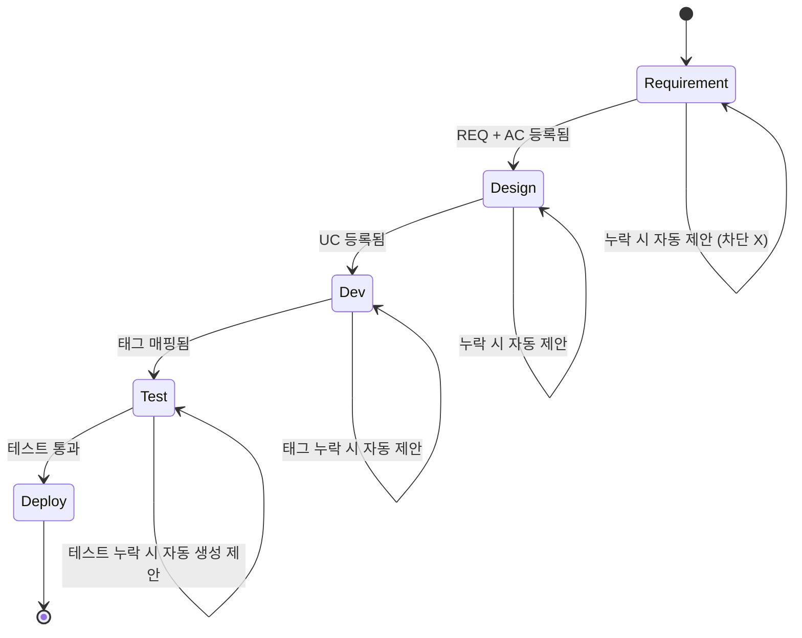
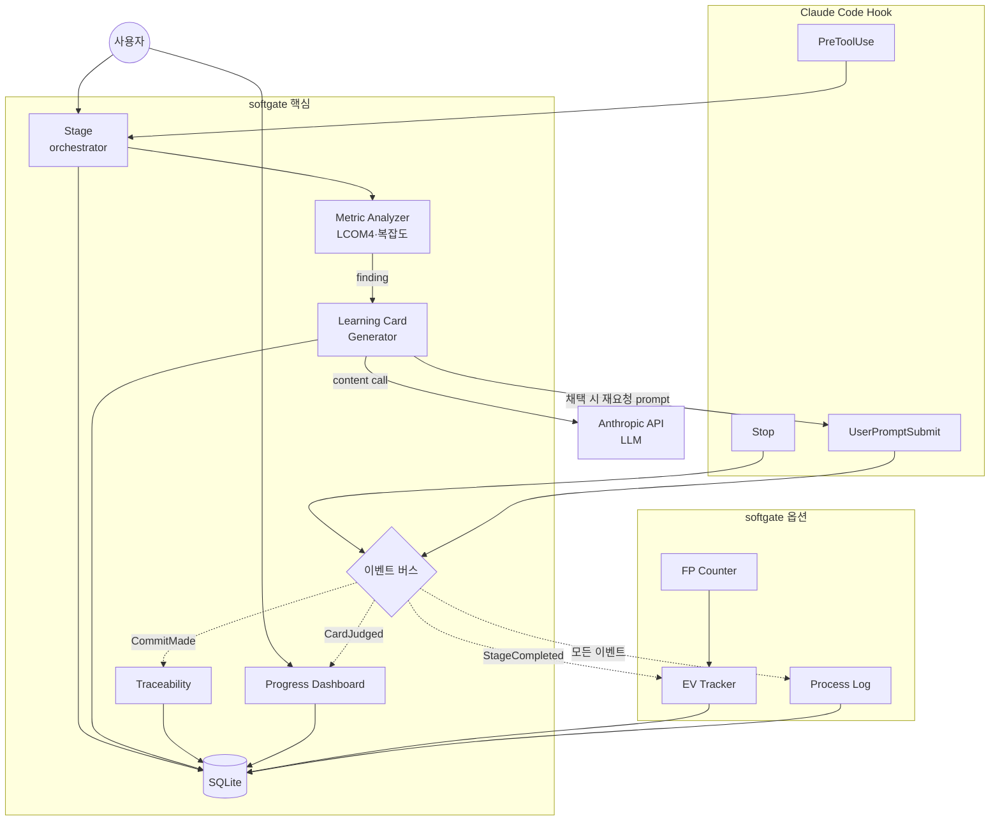
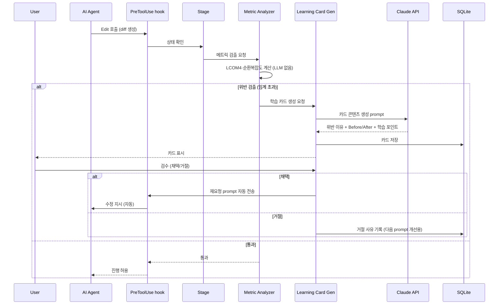
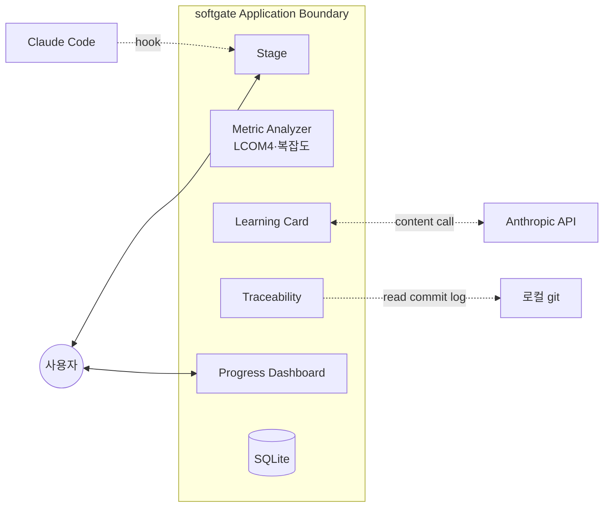

# Architecture: softgate

> **피벗 반영(Day 5)**: LLM 채점(SOLID Judge)을 폐기하고 결정론적 검출(Metric Analyzer: LCOM4, 순환복잡도)과 LLM 설명(Learning Card)으로 분리했다. 아래 다이어그램·표의 옛 "SOLID Judge" 노드는 검출층 Metric Analyzer로 읽는다. 검출은 LLM을 쓰지 않으므로 "LLM judge subagent"는 LLM 설명층 호출로 정정한다. 경위는 DISCUSSION_LOG.md Day 5.

## 0. 한 줄 요약

핵심 폐루프(Metric Analyzer 검출 + Learning Card 설명) + Stage / Traceability(얇은 데모) + Progress Dashboard(설계) + SQLite 단일 store + LLM 설명층 subagent + Claude Code Hook 통합.

## 1. 5 Stage (SAGA 패턴 — 부드러운 적용)

softgate의 5 Stage는 SDLC를 SAGA로 모델링한 결과. 다만 강제 차단이 아니라 **누락 검출 + 자동 제안** 방식으로 적용.

SAGA 패턴 자체는 1987년 분산 시스템 논문에서 정립된 것이고, 긴 트랜잭션을 잘게 잘라 독립 단위로 수행하면서 단계 간 ordering constraint를 두는 발상이 핵심. softgate는 그 패턴을 SDLC 도메인에 적용하되, 사용자 짜증 유발을 회피하기 위해 보상 트랜잭션을 "자동 rollback"이 아닌 "사용자에게 누락 알림 + 자동 생성 제안"으로 부드럽게 재해석.

| Stage | 기대 산출물 | 누락 검출 시 동작 |
|---|---|---|
| 1. Requirement | REQ-NNN 명시 + acceptance criteria | "관련 REQ ID 매핑 없음. 추가하시겠습니까?" 자동 제안 |
| 2. Design | UC-NNN 명시 + 영향 모듈 | "UC 없음. 마크다운 템플릿 자동 생성?" 제안 |
| 3. Dev | commit message에 `[REQ-NNN][UC-NNN]` 태그 | "태그 누락. 자동 매핑 후보 표시" |
| 4. Test | pytest 파일 존재 | "테스트 누락. 4종 기본 케이스 자동 생성?" 제안 |
| 5. Deploy | 통합 테스트 통과 + 문서 갱신 | "문서 drift 감지. 자동 갱신?" 제안 |



기존 SDLC 도구(claude-sdlc, agentic-sdlc, Superpowers 등)는 phase 흐름을 강제. softgate는 정반대로 **부드러운 제안**만 — 사용자 의사결정 우선.

## 2. Choreography vs Orchestration — Hybrid

SOA·마이크로서비스 영역에서 모듈 간 통신 방식은 크게 두 가지로 분류된다.

- **Choreography**: 각 모듈이 자율적으로 이벤트 발행·구독. 중앙 조정자 없음. 결합도 낮음. 흐름 추적 어려움
- **Orchestration**: 중앙 조정자가 모듈 호출 순서 관리. 흐름 명확. 단일 중단점(SPOF) 위험

softgate는 4 핵심 + 3 옵션의 hybrid.

| 모듈 | 통신 방식 | 이유 |
|---|---|---|
| Metric Analyzer + Learning Card | orchestration (Stage가 호출) | 코드 변경 시점에 동기적으로 실행 필요 |
| Stage | orchestration 중심 (state machine 관리) | SDLC 진행 상태의 중앙 조정자 역할 |
| Traceability | choreography (CommitMade 이벤트 구독) | commit 발생 시점에 비동기 갱신 |
| Progress Dashboard | choreography (CardJudged 이벤트 구독) | 학습 카드 검수 결과 비동기 집계 |
| EV Tracker (옵션) | choreography (StageCompleted 구독) | 진척 측정 비동기 |
| FP Counter (옵션) | choreography (사용자 직접 호출) | 사용자 입력 시점 무관 |
| Process Log (옵션) | choreography (모든 이벤트 구독) | 전체 trace 비동기 집계 |

Stage가 "최소 orchestration" 역할, 나머지는 choreography. 중앙 조정자 부하 분산 + 흐름 추적성 절충.

## 3. 모듈 구조 다이어그램



이벤트 버스는 초기 구현에서 SQLite의 `events` 테이블 polling으로 시작. Future Work에서 publish/subscribe 미들웨어(Redis Streams, NATS 등)로 분리 가능한 구조.

## 4. Learning Card 데이터 흐름 (핵심 차별점)



LLM은 자연어 콘텐츠만 채우고, 데이터 모델·파이프라인·검수 로직·DB 저장·CLI 렌더링은 본인 구현. AI 생성물 취급 회피가 설계 원칙.

자세한 학습 카드 시스템은 [LEARNING_CARDS.md](./LEARNING_CARDS.md).

## 5. SQLite 스키마

```sql
CREATE TABLE sessions (
    id TEXT PRIMARY KEY,
    project_path TEXT NOT NULL,
    started_at TIMESTAMP NOT NULL,
    ended_at TIMESTAMP
);

CREATE TABLE stages (
    id INTEGER PRIMARY KEY,
    session_id TEXT REFERENCES sessions(id),
    stage_name TEXT CHECK(stage_name IN ('Requirement','Design','Dev','Test','Deploy')),
    entered_at TIMESTAMP NOT NULL,
    missing_artifacts TEXT,
    suggestions_made TEXT
);

CREATE TABLE requirements (
    id TEXT PRIMARY KEY,
    session_id TEXT REFERENCES sessions(id),
    title TEXT NOT NULL,
    kind TEXT CHECK(kind IN ('functional','non_functional')),
    acceptance_criteria TEXT
);

CREATE TABLE usecases (
    id TEXT PRIMARY KEY,
    session_id TEXT REFERENCES sessions(id),
    req_ids TEXT,
    actor TEXT NOT NULL,
    scenario TEXT NOT NULL,
    mermaid TEXT,
    include_uc_ids TEXT
);

CREATE TABLE solid_judgments (
    id INTEGER PRIMARY KEY,
    session_id TEXT REFERENCES sessions(id),
    diff_hash TEXT NOT NULL,
    srp_score INTEGER, ocp_score INTEGER, lsp_score INTEGER,
    isp_score INTEGER, dip_score INTEGER,
    cohesion_score INTEGER, coupling_score INTEGER,
    judged_at TIMESTAMP
);

-- 학습 카드 (핵심 차별점)
CREATE TABLE learning_cards (
    id TEXT PRIMARY KEY,
    session_id TEXT REFERENCES sessions(id),
    judgment_id INTEGER REFERENCES solid_judgments(id),
    principle TEXT NOT NULL,
    score INTEGER NOT NULL,
    violation_reason TEXT,
    cost_example TEXT,
    before_code TEXT,
    after_code TEXT,
    learning_points TEXT,
    revision_prompt TEXT,
    generated_at TIMESTAMP NOT NULL,
    user_accepted INTEGER,  -- 0=거절, 1=채택, NULL=미검수
    user_feedback TEXT,
    reviewed_at TIMESTAMP
);

CREATE TABLE traceability (
    id INTEGER PRIMARY KEY,
    req_id TEXT REFERENCES requirements(id),
    uc_id TEXT REFERENCES usecases(id),
    code_path TEXT,
    test_path TEXT,
    last_updated TIMESTAMP,
    gap_type TEXT  -- 'no_uc' | 'no_code' | 'no_test' | 'complete'
);

CREATE TABLE dashboard_metrics (
    id INTEGER PRIMARY KEY,
    session_id TEXT REFERENCES sessions(id),
    measured_at TIMESTAMP NOT NULL,
    cards_total INTEGER,
    cards_accepted INTEGER,
    solid_pass_rate REAL,
    streak_days INTEGER,
    principle_distribution TEXT
);

-- 옵션
CREATE TABLE wbs_tasks (
    id TEXT PRIMARY KEY,
    session_id TEXT REFERENCES sessions(id),
    title TEXT NOT NULL,
    planned_value REAL,
    earned_value REAL DEFAULT 0,
    actual_cost REAL DEFAULT 0
);

CREATE TABLE fp_items (
    id INTEGER PRIMARY KEY,
    session_id TEXT REFERENCES sessions(id),
    kind TEXT CHECK(kind IN ('EI','EO','EQ','ILF','EIF')),
    complexity TEXT CHECK(complexity IN ('low','avg','high')),
    weight REAL NOT NULL
);

CREATE TABLE transcripts (
    id INTEGER PRIMARY KEY,
    session_id TEXT REFERENCES sessions(id),
    captured_at TIMESTAMP,
    stage_classified TEXT,
    iso25010_dimension TEXT
);

CREATE TABLE events (
    id INTEGER PRIMARY KEY,
    session_id TEXT REFERENCES sessions(id),
    event_type TEXT NOT NULL,
    payload TEXT,
    published_at TIMESTAMP,
    consumed_by TEXT
);
```

WAL 모드(`PRAGMA journal_mode=WAL`). hook과 모듈 간 메모리 가시성·일관성 보장.

## 6. CLI 명령 체계

```
softgate init                              # .softgate/ 생성, SQLite 초기화
softgate session start                     # 새 세션 시작
softgate session status                    # 현재 stage·미완 작업 표시

softgate req add <title> <kind>            # REQ-NNN 부여
softgate uc add <markdown_file>            # UC-NNN 부여, markdown 파싱

softgate analyze <file>                    # 결정론적 메트릭 검출 (LLM 없음)
softgate cards                             # 미검수 학습 카드 목록
softgate cards review <CARD-NNN>           # 카드 검수 (채택/거절)
softgate cards stats                       # 카드 통계

softgate trace                             # 전체 traceability 매트릭스 출력
softgate trace gaps                        # 누락 항목만 표시
softgate trace export                      # 매트릭스 markdown export

softgate dashboard                         # Progress Dashboard 표시
softgate dashboard --html                  # HTML 출력

# 옵션
softgate ev                                # EV 계산
softgate fp add <kind> <complexity>        # FP 입력
softgate process-log                       # ISO 25010 매핑 표시
```

## 7. Application Boundary

SW공학에서 application boundary는 시스템이 다루는 영역과 외부 액터·의존성을 분리하는 경계선. softgate의 경계.



**내부**: 핵심 모듈 + SQLite + LLM 설명층 콘텐츠 prompt. 검출(Metric Analyzer)은 로컬 계산이라 외부 호출 없음.
**외부**: 사용자 + Claude Code agent + Anthropic API + git.

카드 콘텐츠 생성 subagent만 호출은 내부, 실행은 외부(Anthropic API). 검출은 외부로 코드를 보내지 않고, 설명 카드 생성 시에만 코드가 전송된다. 이 전송이 보안 관점 risk → Future Work의 TEE 기반 로컬 실행으로 향후 보강.

## 8. 위험 대응

REQUIREMENTS Section 5의 worst-case와 매핑.

| WC | 대응 위치 | 메커니즘 |
|---|---|---|
| WC-01: hook 우회 | Stage | 다양한 도구 등록 + shell metacharacter는 잡기 어려움. 단 차단이 아닌 제안이라 우회 자체가 큰 문제 아님 |
| WC-02: LLM 설명층 환각 | Learning Card | 검출은 결정론적이라 환각 없음. 설명 카드는 사용자 검수 필수, 거절 시 사유 기록 |
| WC-03: hook timeout | Stage | SQLite WAL + 동기 쓰기. 500ms 이내 응답. default-allow fallback |
| WC-04: SQLite 손상 | 전체 | 매일 VACUUM + `.bak` dump |
| WC-05: FP invalid 입력 | FP Counter | Pydantic validation |
| WC-NEW: 학습 카드 환각 콘텐츠 | Learning Card | 사용자 검수 필수. 거절 시 사유 기록 → 다음 prompt 개선 |
| WC-NEW: commit 태그 파싱 실패 | Traceability | 태그 패턴 정의 + fallback regex |

## 9. 설계 메모

설계하면서 짚어둘 두 가지.

1. **5 Stage가 너무 워터폴 같지 않나** — 애자일은 stage 경계가 흐린 편. softgate가 워터폴을 강제하는 모양새이지만, 실제로는 차단하지 않고 검출·제안만 하므로 사용자가 자유롭게 stage를 오갈 수 있는 구조. 애자일 스프린트 안의 SAGA에 가까운 형태.

2. **choreography 부분이 진짜 choreography인가** — SQLite `events` 테이블 polling으로 시작하는 구조라 엄격한 pub/sub은 아닌 상태. "poor man's choreography" 수준임을 정직하게 적어둠. FUTURE_WORK Section 1에서 진짜 pub/sub 미들웨어로 분리하는 것이 다음 단계.

ARCHITECTURE는 구현 단계 들어가면서 계속 수정될 가능성. 이 문서가 최종본이 아닌 상태.
