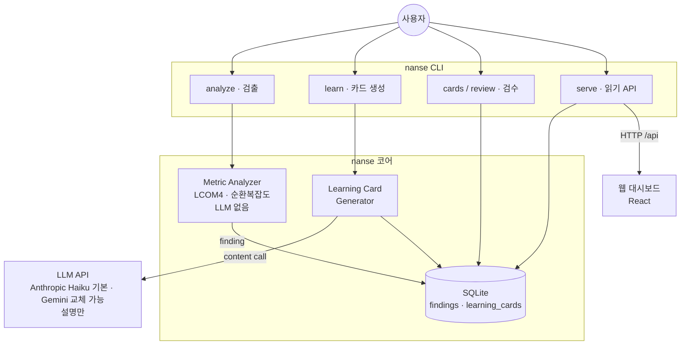
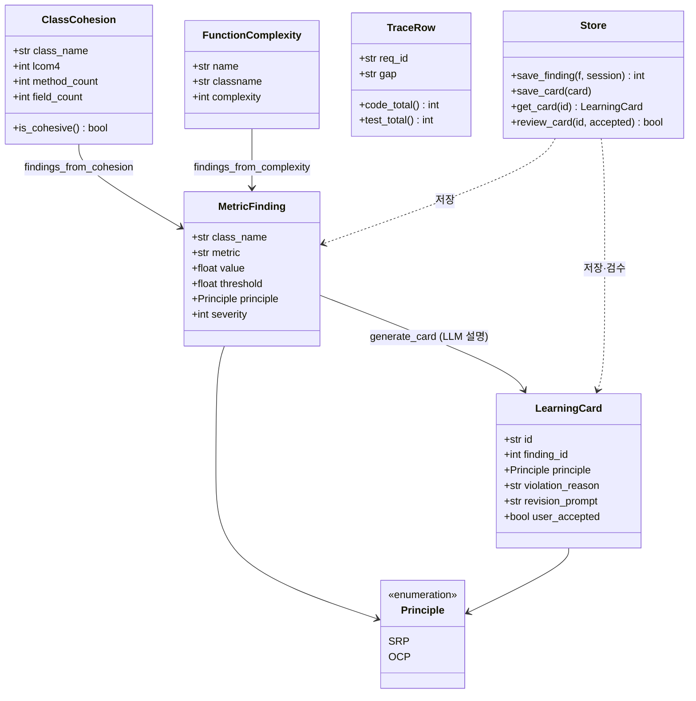
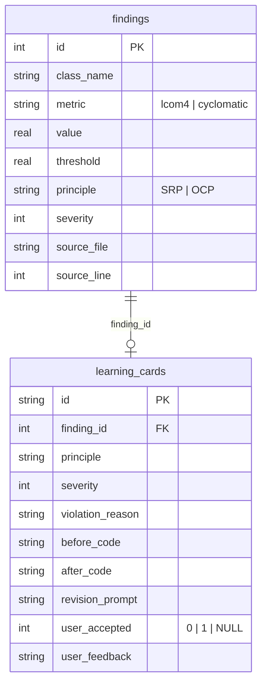

# Architecture: NaN-SE

> Day 5 피벗으로 LLM 점수 매기기를 버리고 결정론적 검출(LCOM4·순환복잡도)과 LLM 설명(Learning Card)으로 분리했다. 1절의 SAGA·Stage·이벤트 버스·EV/FP/Process Log는 피벗 때 접은 원설계이고 구현하지 않았다(설계 기록). 실제 구현 범위는 0절 참조.

## 0. 한 줄 요약

구현된 것: 핵심 폐루프(Metric Analyzer 검출 + Learning Card 설명) + SQLite 단일 store(findings·learning_cards 2테이블) + 읽기 API + 웹 대시보드 + CLI + 요구 추적 최소 구현(`nanse trace`: UC↔코드↔테스트 존재 검증·gap 분류). 설계로만 남은 것: Claude Code Hook 통합, 5 Stage, Progress Dashboard 모듈, EV/FP/Process Log, 그리고 Traceability의 전체 설계(commit 태그 자동 갱신·Mermaid export).

## 1. 원설계 구상 (미구현, 참고용)

피벗 전에는 SDLC 5단계를 SAGA에 빗댄 Stage 게이트, choreography/orchestration 이벤트 버스, Traceability·Dashboard·EV/FP 모듈을 그렸다. 모두 구현하지 않았다. SAGA 비유는 느슨하다(SDLC 단계는 분산 트랜잭션이 아니다). 실제 구현은 검출·설명 두 모듈을 CLI가 직접 호출하는 단순 파이프라인이라 게이트도 이벤트 버스도 필요 없었다. 전체 원설계는 git 히스토리에 있고, 여기서는 접은 사실만 남긴다.

## 2. 모듈 구조 (구현된 것)

### 2.1 as-built 다이어그램

아키텍처 스타일은 검출→설명→검수로 흐르는 pipe-filter에, 웹은 HTTP 경계로 분리한 client-server를 더한 형태다. 제어 흐름은 사용자가 CLI 명령을 부르는 절차 기반이고, 원설계의 hook 이벤트 기반 트리거는 미구현이다. 실제 코드로 동작하는 부분만 추리면 다음과 같다. hook도 이벤트 버스도 Stage도 없다. `nanse` CLI가 검출과 설명을 직접 호출하고, SQLite 두 테이블에 저장하며, 읽기 API가 그 결과를 웹 대시보드에 노출한다.



### 2.2 클래스 다이어그램

실제 코드의 핵심 dataclass와 그 흐름이다. 검출층이 `ClassCohesion`·`FunctionComplexity`를 만들고, 임계 초과분이 `MetricFinding`이 되며, finding을 LLM 설명층이 `LearningCard`로 채운다. `Store`가 둘을 저장하고, `TraceRow`는 요구 추적 결과다.



## 3. 구현과 LLM의 경계

검출(Metric Analyzer)은 LLM 없이 결정론적으로 돌고, LLM은 학습 카드의 자연어 콘텐츠만 채운다. 데이터 모델·파이프라인·검수·DB 저장·CLI는 본인 구현이다. 결과물이 "AI가 만든 것"으로 취급되지 않게 한 것이 설계 원칙이다. 실제 흐름은 2.1 as-built와 같다(원설계의 hook 자동 전송은 미구현). 카드 시스템 상세는 [LEARNING_CARDS.md](./LEARNING_CARDS.md).

## 4. SQLite 스키마

### 4.1 실제 구현 스키마 (`nanse/db/store.py`)

피벗 후 store는 두 테이블로 단순화됐다. 검출 결과(`findings`)와 그 위반을 설명한 학습 카드(`learning_cards`)이고, 카드는 `finding_id`로 finding을 참조한다. LLM 점수 매기기 구조(`solid_judgments`)는 폐기됐으므로 점수 컬럼이 없다.

```sql
CREATE TABLE findings (
    id          INTEGER PRIMARY KEY AUTOINCREMENT,
    session_id  TEXT NOT NULL,
    class_name  TEXT NOT NULL,
    metric      TEXT NOT NULL,        -- 'lcom4' | 'cyclomatic'
    value       REAL NOT NULL,
    threshold   REAL NOT NULL,
    principle   TEXT NOT NULL,        -- 'SRP' | 'OCP'
    severity    INTEGER NOT NULL,
    source_file TEXT,
    source_line INTEGER,
    created_at  TEXT NOT NULL
);

CREATE TABLE learning_cards (
    id               TEXT PRIMARY KEY,
    session_id       TEXT NOT NULL,
    finding_id       INTEGER NOT NULL,   -- findings(id) 참조
    principle        TEXT NOT NULL,
    severity         INTEGER NOT NULL,
    code_hash        TEXT NOT NULL,
    violation_reason TEXT NOT NULL,
    cost_example     TEXT NOT NULL,
    before_code      TEXT NOT NULL,
    after_code       TEXT NOT NULL,
    learning_points  TEXT NOT NULL,
    revision_prompt  TEXT NOT NULL,
    user_accepted    INTEGER,           -- 0=거절, 1=채택, NULL=미검수
    user_feedback    TEXT,
    source_file      TEXT,
    source_line      INTEGER,
    generated_at     TEXT NOT NULL,
    reviewed_at      TEXT
);
```

두 테이블의 관계는 단순하다. 하나의 finding이 0개 또는 1개의 학습 카드를 가진다(검출은 항상 일어나지만 설명 카드는 `learn`을 돌려야 생긴다).



### 4.2 원설계 스키마 (접음, 참고용)

피벗 전 11테이블 설계다. `sessions`, `stages`, `requirements`, `usecases`, `solid_judgments`(LLM 점수 매기기), `traceability`, `dashboard_metrics`, `wbs_tasks`, `fp_items`, `transcripts`, `events`로 5 Stage·Traceability·Dashboard·EV/FP·이벤트 버스를 모두 담으려 했다. Day 5 피벗에서 검출·설명 폐루프로 범위를 좁히며 위 2테이블만 남겼다. 전체 원설계는 git 히스토리에 남아 있고, 여기서는 접은 사실만 기록한다.

## 5. CLI 명령 체계

실제 구현된 명령은 다음 7개다 (`nanse --help`로 확인).

```
nanse analyze <file>          # 결정론적 메트릭 검출 (LLM 없음)
nanse learn <file>            # 위반 finding을 학습 카드로 설명 (ANTHROPIC_API_KEY 또는 GEMINI_API_KEY 필요)
nanse cards                   # 미검수 학습 카드 목록
nanse review <CARD-NNN>       # 카드 한 장을 띄워 채택/거절
nanse trace [--gaps]          # 요구(UC)↔코드↔테스트 존재 검증 매트릭스 + gap (LLM 없음)
nanse seed-demo               # API 키 없이 대시보드를 보도록 예시 데이터 채움
nanse serve                   # 읽기 API 서버 (FastAPI + uvicorn)
```

검출 → 설명 → 검수가 한 흐름이고, 검출과 추적은 LLM 없이 단독 실행할 수 있다.

아래 명령은 원설계 구상이며 구현하지 않았다(설계만).

```
nanse init / session start / session status     # Stage 모듈
nanse req add / uc add / trace export            # Traceability 전체 설계 (자동 갱신·export는 미구현)
nanse dashboard                                  # Progress Dashboard (웹 대시보드가 일부 대체)
nanse ev / fp add / process-log                  # EV / FP / Process Log 옵션
```

## 6. 보안·위험 메모

검출은 로컬 계산이라 코드를 외부로 보내지 않는다. 학습 카드 생성 시에만 대상 코드가 LLM API(Anthropic 기본·Gemini 교체 가능)로 전송되며, 이 전송이 유일한 보안 risk다(로컬 모델 실행으로 보강 가능). 주요 실패 대응(REQUIREMENTS 5절 worst-case와 매핑):

| 위험 | 대응 |
|---|---|
| LLM 설명층 환각 | 검출은 결정론적이라 환각 없음. 카드는 사용자 검수 필수, 거절 사유 기록 |
| SQLite 손상 | WAL 모드 + 정기 백업(.bak) |
| 잘못된 입력 | Pydantic validation |

ARCHITECTURE는 구현 단계에 들어가면서 계속 수정될 수 있다. 이 문서는 최종본이 아니다.
