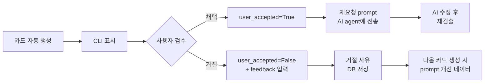

# Learning Card System: NaN-SE

> **피벗 반영(Day 5)**: 위반 검출은 결정론적 메트릭(Metric Analyzer: LCOM4, 순환복잡도)이 하고, LLM은 확정된 finding을 학습 카드로 설명만 한다. 아래 옛 "SOLID Judge" 표현은 검출층(Metric Analyzer)으로 정정한다. 경위는 DISCUSSION_LOG.md Day 5.

핵심 차별점인 학습 카드 시스템의 데이터 모델·생성 파이프라인·검수 흐름·CLI 인터페이스를 정리한 문서.

## 0. 한 줄 요약

Metric Analyzer가 결정론적으로 위반을 검출하면 단순 코멘트로 끝내지 않고, LLM 설명층이 "왜 위반인지 + 운영 단계 비용 + Before/After + 재요청 prompt"로 구성된 학습 카드를 생성. 사용자가 카드를 검수해 채택·거절한다. 채택한 카드의 재요청 prompt는 사용자가 AI agent에 직접 붙여넣어 수정을 받는다(자동 전송은 설계 단계 구상이며 구현하지 않았다).

## 1. 왜 학습 카드인가

기존 LLM 기반 코드 리뷰 도구(CodeRabbit, Greptile, Qodo 등)는 위반에 대한 코멘트를 남기는 데서 끝난다. 사용자가 그 코멘트를 읽고, 이해하고, 직접 수정하거나 AI에 다시 지시해야 한다.

NaN-SE는 두 가지를 더한다.

1. **위반을 학습 기회로 전환** — 짧은 자연어 설명 + Before/After 코드로 사용자가 즉시 이해
2. **재요청 prompt 자동 생성** — AI agent에 다시 보낼 수정 지시까지 함께 제공

기술부채가 쌓이는 까닭은 결국 개발자가 바이브코딩된 코드를 직접 짜지도, 꼼꼼히 리뷰하지도 않기 때문이다. NaN-SE는 그 단계에서 학습 허들을 낮춰 SW공학 원칙을 지키는 일이 지루하거나 귀찮지 않게 하려는 시도다.

## 2. 데이터 모델

> 아래는 초기 설계 스케치다. 실제 구현 모델은 `nanse/learning_card/models.py`에 있고, 피벗으로 점수 매기기를 없앴으므로 `score`·`diff_hash` 대신 `severity`·`code_hash`를 쓰고 `finding_id`로 검출 finding을 참조한다(점수 컬럼 없음).

```python
from pydantic import BaseModel, Field
from enum import Enum
from datetime import datetime

class Principle(str, Enum):
    SRP = "Single Responsibility"
    OCP = "Open-Closed"
    LSP = "Liskov Substitution"
    ISP = "Interface Segregation"
    DIP = "Dependency Inversion"
    HIGH_COHESION = "High Cohesion"
    LOW_COUPLING = "Low Coupling"

class LearningCard(BaseModel):
    # 식별
    id: str  # CARD-001
    session_id: str
    finding_id: int  # Metric Analyzer 검출 finding ID
    
    # 점수 매기기 결과
    principle: Principle
    score: int = Field(ge=0, le=10)  # 0-10, 낮을수록 위반 심각
    diff_hash: str
    
    # LLM이 생성하는 자연어 콘텐츠
    violation_reason: str  # 3-5줄 자연어 설명
    cost_example: str       # 운영 단계에서 어떤 비용으로 돌아오는지 1 예시
    before_code: str        # 위반 코드 스니펫
    after_code: str         # 리팩토링 후 코드 스니펫
    learning_points: list[str]  # 3개 bullet (핵심 학습 포인트)
    revision_prompt: str    # AI agent에 다시 보낼 수정 지시
    
    # 본인이 짠 검수 로직
    user_accepted: bool | None  # None=미검수, True=채택, False=거절
    user_feedback: str | None   # 거절 시 사유
    
    # 메타
    generated_at: datetime
    reviewed_at: datetime | None
```

## 3. 카드 생성 파이프라인 (본인 구현)

```python
from anthropic import Anthropic

def generate_card(violation: SolidViolation) -> LearningCard:
    # 1. 구조화된 prompt 빌드 (본인 템플릿)
    prompt = build_learning_card_prompt(violation)
    
    # 2. LLM 호출 (Haiku, temperature=0.3)
    client = Anthropic()
    response = client.messages.create(
        model="claude-haiku-4-5-20251001",
        max_tokens=1500,
        temperature=0.3,
        messages=[{"role": "user", "content": prompt}],
    )
    
    # 3. 응답을 Pydantic 모델로 파싱 (본인 구현)
    parsed = parse_llm_response(response.content[0].text)
    
    # 4. 카드 생성 + DB 저장 (본인 schema)
    card = LearningCard(
        id=next_card_id(),
        session_id=current_session_id(),
        judgment_id=violation.judgment_id,
        principle=violation.principle,
        score=violation.score,
        diff_hash=violation.diff_hash,
        violation_reason=parsed["violation_reason"],
        cost_example=parsed["cost_example"],
        before_code=parsed["before_code"],
        after_code=parsed["after_code"],
        learning_points=parsed["learning_points"],
        revision_prompt=parsed["revision_prompt"],
        user_accepted=None,
        user_feedback=None,
        generated_at=datetime.now(),
        reviewed_at=None,
    )
    save_to_sqlite(card)
    
    # 5. 이벤트 발행 (Progress Dashboard 갱신 위해)
    publish_event("CardGenerated", {"card_id": card.id})
    
    return card
```

LLM 호출은 자연어 콘텐츠 생성에만 한정. 데이터 모델 정의·prompt 빌드·응답 파싱·DB 저장·이벤트 발행은 전부 본인 구현. 보고서에 "이 도구의 어디가 본인 구현인가" 명확히 보여줄 수 있는 구조.

## 4. LLM Prompt 템플릿

```python
LEARNING_CARD_PROMPT = """당신은 SW공학 원칙을 가르치는 학습 도우미입니다.
다음 SOLID 위반에 대한 학습 카드를 JSON 형식으로 생성하세요.

## 위반 정보
- 원칙: {principle}
- 점수: {score}/10
- diff:
```{diff}```

## 출력 형식 (JSON, 다른 텍스트 없음)
{
  "violation_reason": "왜 이게 위반인지 3-5줄 자연어 설명",
  "cost_example": "이 위반이 운영 단계에서 어떤 비용으로 돌아오는지 구체 예시 1개",
  "before_code": "위반 코드 스니펫 (원본에서 발췌)",
  "after_code": "리팩토링 후 코드 스니펫",
  "learning_points": ["bullet 1", "bullet 2", "bullet 3"],
  "revision_prompt": "AI coding agent에 다시 보낼 수정 지시 (구체적인 리팩토링 가이드 포함)"
}

## 톤
- 자연어 한국어
- 짧고 직설적
- 학습자가 이해하기 쉽게
- 추측이 아닌 코드 사실에 기반"""
```

prompt 자체가 본인이 작성한 자산. 거절 사유 데이터가 누적되면 prompt 개선 (자동 또는 수동).

## 5. 검수 흐름 — "검수는 사람" 정책 실천

> 아래 흐름에서 실제 구현된 구간은 카드 생성 → CLI 표시 → 채택/거절 → 거절 사유 저장이다. "재요청 prompt AI agent에 전송"과 그 이후 재검출 루프는 설계 단계 구상이며 구현하지 않았다. 채택 후에는 사용자가 카드의 prompt를 직접 AI에 붙여넣는다.



채택률이 60% 미만으로 떨어지면 prompt 개선이 필요하다는 신호. Progress Dashboard에서 시각화.

## 6. CLI 인터페이스

```bash
# 미검수 카드 목록
$ nanse cards
CARD-005 | SRP | src/auth.py | 미검수
CARD-006 | OCP | src/db.py   | 미검수

# 개별 카드 검수
$ nanse review CARD-005

╭─ CARD-005 | SRP Violation (LCOM4=3 > 1) ─────────────╮
│                                                       │
│ 위반 이유:                                            │
│   AuthService 클래스가 인증, 토큰 발급, 이메일 발송,   │
│   로그인 실패 횟수 관리를 모두 담당하고 있어 책임이    │
│   3개 이상으로 늘어난 상태.                           │
│                                                       │
│ 운영 단계 비용 예시:                                  │
│   이메일 발송 로직 변경 시 인증 모듈 전체 회귀 테스트  │
│   가 필요해져 배포 지연 발생 가능.                    │
│                                                       │
│ Before:                                               │
│   class AuthService:                                  │
│       def login(self): ...                            │
│       def send_email(self): ...                       │
│       def issue_token(self): ...                      │
│                                                       │
│ After:                                                │
│   class AuthService:                                  │
│       def login(self): ...                            │
│   class EmailNotifier:                                │
│       def send_email(self): ...                       │
│   class TokenService:                                 │
│       def issue_token(self): ...                      │
│                                                       │
│ 학습 포인트:                                          │
│   • SRP는 클래스가 변경되는 이유가 하나여야 한다는 원칙 │
│   • 책임 분리는 테스트 격리에도 도움                  │
│   • 변경 사유가 다르면 클래스도 다르게                │
│                                                       │
╰───────────────────────────────────────────────────────╯

[A]ccept / [R]eject / [S]kip: A

✓ 채택됨. 카드의 재요청 prompt를 복사해 AI agent에 붙여넣어 수정을 받는다.
```

거절 시:
```
[A]ccept / [R]eject / [S]kip: R
거절 사유 (Enter로 건너뛰기): 이 분리는 과한 추상화 같다
✓ 거절 사유 기록됨. 다음 카드 생성 시 prompt 개선에 반영됨.
```

## 7. 본인 구현 vs LLM 구현 영역 (보고서용)

| 영역 | 누가 구현 | 코드 위치 |
|---|---|---|
| 데이터 모델 (Pydantic) | 본인 | `nanse/learning_card/models.py` |
| 카드 생성 파이프라인 | 본인 | `nanse/learning_card/generator.py` |
| LLM prompt 템플릿 | 본인 | `nanse/learning_card/prompts.py` |
| **자연어 콘텐츠 생성** | **LLM (Claude Haiku)** | Anthropic API 호출 |
| 응답 파싱·검증 (Pydantic) | 본인 | `nanse/learning_card/parser.py` |
| 사용자 검수 인터페이스 (CLI) | 본인 | `nanse/cli/__init__.py` (`cards`·`review`) |
| DB 저장·조회 | 본인 | `nanse/db/store.py` |
| 결정론적 검출 (LCOM4·복잡도) | 본인 | `nanse/metrics/` (`lcom.py`·`complexity.py`·`findings.py`) |

이 명확한 분리가 "AI 생성물 취급" 우려에 대한 답. 보고서·발표에서 본인 구현 영역을 코드로 직접 보여줄 수 있는 구조. (거절 사유 기반 prompt 자동 개선, 이벤트 발행은 설계 단계 구상이며 구현하지 않았다.)

## 8. 거절 사유 데이터로 prompt 개선 (간단 버전)

거절 사유가 누적되면 패턴 분석을 통해 prompt를 개선한다. 초기 구현은 단순.

```python
def analyze_rejection_patterns(threshold: int = 5) -> list[str]:
    """최근 거절 사유 N개에서 공통 패턴 추출"""
    recent_rejections = query_recent_rejections(limit=threshold)
    
    # 간단한 규칙 기반 (LLM 없이)
    patterns = []
    if all("과한 추상화" in r.feedback for r in recent_rejections):
        patterns.append("학습 카드에서 과한 추상화 제안 회피")
    if all("YAGNI" in r.feedback for r in recent_rejections):
        patterns.append("미래 대비 추상화 금지")
    
    return patterns

# prompt 생성 시 패턴 반영
def build_learning_card_prompt(violation):
    base_prompt = LEARNING_CARD_PROMPT
    patterns = analyze_rejection_patterns()
    if patterns:
        base_prompt += f"\n\n## 추가 제약 (사용자 피드백 반영)\n" + "\n".join(f"- {p}" for p in patterns)
    return base_prompt.format(**violation.dict())
```

초기에는 단순 키워드 매칭. 향후 LLM 자체로 패턴 분석하는 방향으로 확장 가능.

## 9. 한계

- **콘텐츠 일관성**: 같은 위반에 대해 LLM이 매번 다른 카드를 생성할 수 있음. temperature 낮춤(0.3) + 사용자 검수로 대응
- **카드 길이**: LLM이 짧게/길게 들쭉날쭉. max_tokens=1500 제한 + 토큰 절약 prompt 디자인
- **거절 사유 NLP**: 초기에는 단순 키워드 매칭. 사용자가 일관된 표현을 쓰지 않으면 패턴 추출 어려움
- **재요청 루프**: 재요청 prompt로 AI가 수정한 뒤 또 위반이 나오면 카드가 다시 생성된다. 최대 3회 후 사람이 ruling하도록 제한
