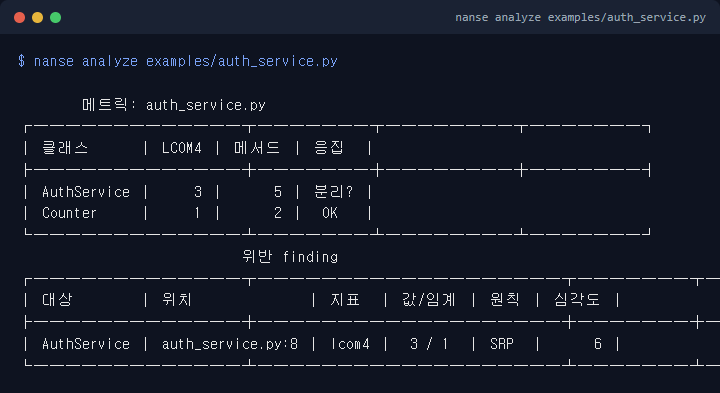
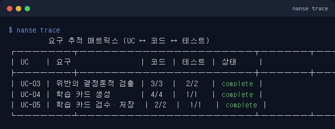
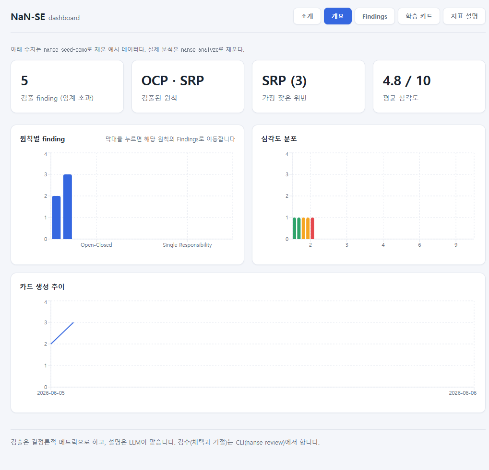
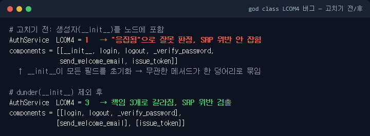
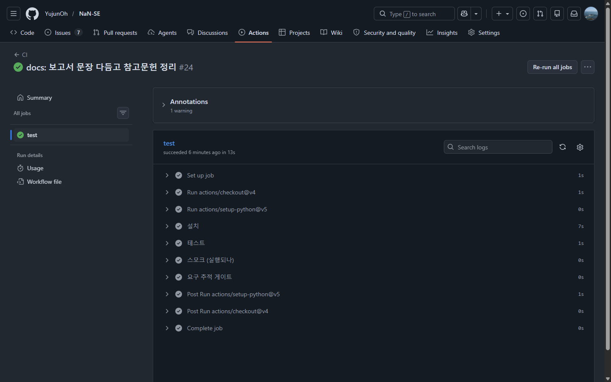
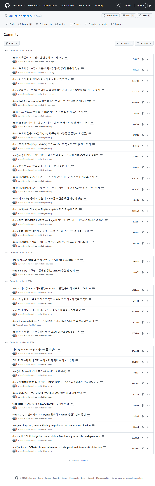
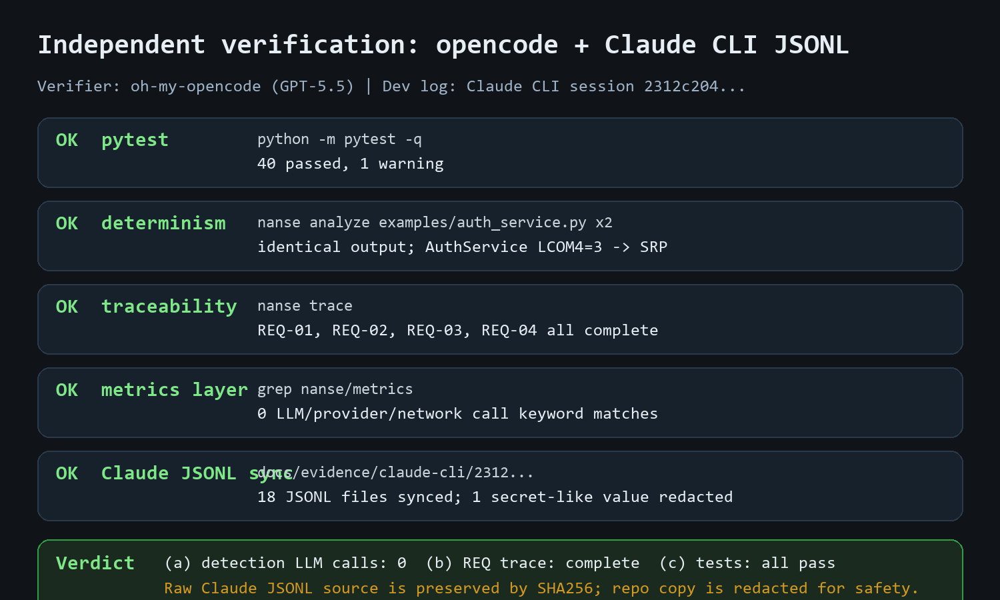

# 프로세스에 입각한 바이브코딩의 효과: NaN-SE 개발 보고서

- 과목: 소프트웨어공학 (담당 윤영 교수)
- 학번/이름: C435247 오유준
- 기간: 2026-05-27 ~ 2026-06-08
- 저장소: https://github.com/YujunOh/NaN-SE

> 착수부터 마감까지의 의사결정·피벗은 docs/DISCUSSION_LOG.md(Day 1~12)와 커밋 이력에 날짜별로 남겼고, 이 보고서는 그 과정을 두괄식으로 추린 것입니다. SE 상세(유스케이스·다이어그램·지표 한계)는 docs/ 하위 문서에 두고 본문에서는 포인터로 가리킵니다. 최종본은 PDF로 변환해 제출합니다.

## 1. 요약

프로세스를 입히자 AI가 만든 결과물을 그대로 받아들이지 않고 검증하는 절차가 생겼습니다. 효과는 세 장면으로 나타났습니다. 요구분석에서 신뢰성 요구를 먼저 고정한 덕분에, 같은 코드인데 매번 다른 점수가 나오는 현상을 정상 동작이 아니라 요구 위반으로 읽고 설계를 피벗했습니다. 테스트와 문서 검증 단계는 god class 오검출 버그와 문서의 과장을 잡아냈습니다. 그리고 범위를 줄여 마감 가능한 핵심을 지켰습니다.

여기서 말하는 "효과"는 "AI가 코드를 빨리 짜줬다"가 아니라 **과정을 측정 가능하게 만든 것**입니다. 검출은 LLM을 한 번도 호출하지 않는 결정론적 메트릭으로 하고(검출 레이어의 LLM 호출 0), 요구는 REQ→UC→코드→테스트로 추적되며, 40개 테스트가 커밋마다 자동으로 실행됩니다.

## 2. 배경: 소프트웨어 위기와 왜 프로세스인가

소프트웨어는 복잡하고 눈에 잘 보이지 않아서 추측에 기대기 쉽습니다. 그래서 체계적인 절차와 검증이 필요합니다. 바이브코딩은 이 오래된 문제를 다시 키웁니다. 요구·설계·테스트·문서가 뒤로 밀리고, LLM은 같은 입력에도 매번 다른 결과를 내기 때문입니다.

수치도 이를 뒷받침합니다. AI 생성 코드는 직접 작성보다 버그 약 1.7배·보안 취약점 약 2배로 보고되고(CodeRabbit 2025), 470개 PR을 분석한 후속 연구는 보안 취약점 2.74배를 보고합니다(2025.12). AI 리뷰 도구의 실제 버그 검출 정확도는 46%에 그쳐, AI가 AI 산출물을 끝까지 검증하지 못함을 보여줍니다. "돌아간다"와 "안전하게 쓸 수 있다"의 차이를 메우는 것이 프로세스이고, NaN-SE는 코드를 만드는 과정에 그 절차를 끼워넣는 시도입니다.

## 3. 무엇을 만들었나

NaN-SE는 AI가 만든 코드의 응집도·복잡도 위반을 결정론적으로 검출하고, 그 위반을 LLM이 학습 카드로 설명하며, 채택·거절은 사람이 하는 도구입니다. 핵심은 **검출(결정론)과 설명(LLM)을 별도 레이어로 나눈 것**입니다.

- **바이브코딩에 쓴 AI**: Claude CLI(Claude Code). 터미널 한 세션에 편집·실행·git이 묶여 결정 과정이 그대로 로그로 남는 점이 프로세스 증빙에 맞았습니다. 설명층 LLM은 Anthropic Haiku 기본에 Gemini Flash로도 교체 가능합니다.
- **만든 SW**: "바이브코딩 산출물에 SE 절차를 끼워넣는 도구"를 직접 정의했습니다. 과제 주제와 도구 목적이 같아, 도구를 만드는 과정 자체가 주제의 실험이 됐습니다.
- **보조 검증**: 마감 전 다른 도구·모델(oh-my-opencode, GPT-5.5)로 핵심 주장만 교차 확인했습니다. 제3자 감사가 아니라 개발 도구와 다른 모델로 한 번 더 대조한 절차입니다(5장).

검출은 단독으로 결정론적으로 돕니다(같은 코드 → 같은 결과).

요구가 코드·테스트로 빠짐없이 추적되는지는 `nanse trace`가 REQ→UC→코드→테스트 존재로 확인합니다.

검출·검수 현황은 읽기 API와 웹 대시보드로 가시화합니다.

## 4. 단계별 프로세스 적용과 lessons learned

요구분석부터 품질 관리까지 각 단계에 프로세스를 적용하고 교훈을 남겼습니다. 한 줄로 줄이면, **확률적인 부분과 결정론적인 부분을 가르고 경계를 문서로 남기는 것이 모든 단계의 공통 원리**였습니다.

| 단계 | 적용한 프로세스 | 교훈 (lesson learned) |
|---|---|---|
| 요구분석 | 페르소나·페인포인트·비기능(신뢰성) 요구 먼저 고정 | 요구를 먼저 박아 두니 비결정성을 그냥 넘기지 않고 요구 위반으로 읽어 피벗할 수 있었다 |
| 설계 | 검출/설명 분리, Protocol로 결합 최소화(자료 결합) | 확률적 부분과 결정론적 부분을 가르면 테스트·교체가 쉬워진다 |
| 구현 | 직접 구현(LCOM4) vs 재사용(radon) 경계 명시 | 학습 가치 있는 것만 직접 짜고 검증된 것은 빌리는 게 합리적이다 |
| 테스트 | 결정론 기반 단위·통합·회귀·스모크 40개 + CI | 결정론이라 기대값을 고정할 수 있어 회귀 테스트가 성립한다 |
| 품질·유지보수 | 문서에도 V&V 적용, ISO 25010 유지보수성 의식 | 문서도 코드보다 먼저 사실과 어긋날 수 있다 |
| 일정 | WBS·EV, 피벗으로 범위 축소 | 범위를 줄이는 결정도 일정 관리이며, 토의 로그가 공유된 그림이 된다 |

특히 구현 단계에서 결정론적 검출이 실제 버그를 잡았습니다. god class를 넣었는데 생성자(`__init__`)가 모든 필드를 초기화하는 바람에 LCOM4가 1로 잘못 나와 위반이 안 잡혔고, dunder를 제외하자 LCOM4=3으로 갈라졌습니다. 기대값을 박아 둔 테스트가 없었다면 "돌아가는 것처럼 보이는데 틀린" 이 결함을 놓쳤을 것입니다.

품질 단계에서는 코드가 아니라 문서가 더 문제였습니다. 피벗으로 범위를 좁혔는데 피벗 전 설계 문서가 미구현 기능을 구현처럼 적고 있어서, 구현한 것과 설계로만 남긴 것을 모든 문서에서 가르고 정정 사유를 남겼습니다. CI는 커밋마다 40개 테스트와 `nanse analyze` 스모크, `nanse trace` 게이트를 자동 실행합니다.

착수(5/27)부터 마감(6/8)까지 결정·피벗을 날짜별 토의 로그와 커밋에 남겼습니다. 핵심 빌드는 5/28~6/2에 집중됐고 이후는 점검·정리이며, 공백과 막판 집중도 감추지 않고 적었습니다.

상세 산출물은 docs/에 있습니다. 페르소나·5W1H·유스케이스(include/extend)·worst-case 시퀀스는 REQUIREMENTS.md, 클래스·ER 다이어그램과 아키텍처 스타일은 ARCHITECTURE.md, 지표 정의·한계는 METRICS.md를 참조하면 됩니다.

## 5. 효과와 한계

가장 큰 효과는 프로세스가 피벗을 가능하게 한 것입니다. 요구분석에서 신뢰성 요구를 못 박아 둔 덕분에, 같은 코드가 매번 다른 점수를 내는 현상을 도구의 정상 동작이 아닌 버그로 읽고 설계를 바꿀 수 있었습니다. 요구 없이 바이브코딩만 했다면 그 비결정성을 그냥 받아들였을 것입니다.

동시에 프로세스가 모든 것을 막지는 못했습니다. 12일을 들여 결정론적 검출은 두 지표(SRP·OCP)에 그쳤고, 통합 테스트는 얇으며, 문서는 한동안 코드와 어긋났습니다. 프로세스는 결함을 0으로 만들지는 못하고, 다만 결함을 더 일찍 더 자주 드러냅니다. 산출물의 위치도 분명합니다. 운영·배포·보안을 갖추지 못했으므로 이것은 prototype이지 MVP가 아닙니다.

편향을 줄이려고 마감 전 보조 검증을 한 번 더 돌렸습니다. 개발에 쓴 Claude와 다른 모델(GPT-5.5)로 테스트 재실행·결정론 확인·요구 추적·검출 층 LLM 호출 여부를 교차 확인했고, 세 핵심 주장(검출 LLM 0, REQ-01~04 추적 complete, 40개 테스트 통과)이 코드에서 사실로 확인됐습니다. 절차와 결과는 docs/HANDOFF_VERIFICATION.md에 있습니다.

## 6. 결론

바이브코딩으로 빠르게 만든 프로토타입은 빙산의 일각입니다. 요구분석부터 품질 관리까지 프로세스를 한 단계씩 입혔을 때 비로소 결과물을 신뢰할 수 있습니다. 소프트웨어가 복잡하고 비가시적이라는 위기의 본질은 LLM 시대에도 그대로이고, 오히려 확률적 생성이 비결정성을 하나 더 얹었습니다. 그래서 답도 새 유행보다 오래된 원리, 곧 추측을 검증으로 확인하고 확률적 출력 위에 결정론을 받치며 같은 기록을 공유하는 데 있었습니다. 이 프로젝트는 그 원리를 바이브코딩이라는 새 맥락에 다시 적용해 본 기록입니다.

## 참고문헌

각 출처를 어디에 썼는지 함께 적습니다.

- McCabe, T. J. "A Complexity Measure." IEEE Transactions on Software Engineering, SE-2(4), 1976. — 순환복잡도 정의와 임계 10의 근거 (METRICS 2)
- Hitz, M. & Montazeri, B. "Measuring Coupling and Cohesion in Object-Oriented Systems." 1995. — 연결 요소 기반 LCOM4 정의 (METRICS 1)
- Shepperd, M. "A Critique of Cyclomatic Complexity as a Software Metric." Software Engineering Journal, 1988. — 지표 한계의 비판적 근거 (METRICS 3)
- CodeRabbit. "AI 생성 코드 품질 리포트" (2025), coderabbit.ai. — 버그 1.7배·보안 취약점 2배·검출 정확도 46% 통계 (2장)
- 470개 오픈소스 PR 결함 분석 (2025.12). — AI 협업 코드의 보안 취약점 2.74배 (2장)
- "Vibe Coding in Practice: Motivations, Challenges, and a Future Outlook." ICSE 2026 (SEIP). https://kblincoe.github.io/publications/2026_ICSE_SEIP_vibe-coding.pdf — 통제 중심 실천의 현장 근거 (2장)
- "Professional Software Developers Don't Vibe, They Control." arXiv:2512.14012, 2025. — 숙련 개발자의 통제·검증 행태 (2장)
- "Are We SOLID Yet?" — LLM의 SOLID 점수 매기기 불안정성, 검출/설명 분리 피벗의 근거 (2·4장)

---

## 부록 A. 제품으로서의 NaN-SE (더 깊은 생각)

본문은 과제 주제인 "프로세스"에 집중했고, 여기서는 도구를 제품으로 봤을 때의 생각을 따로 정리합니다.

**TCP 비유.** NaN-SE의 컨셉은 "바이브코딩 시대의 TCP"입니다. TCP가 불안정한 IP 위에 신뢰성을 얹듯, 확률적인 AI 코딩 위에 결정론적 검증 층을 얹는다는 발상입니다. 검출을 결정론으로 두고 사람이 검수하는 구조가 그 핵심이며, hook 자동 트리거·게이트 같은 나머지 비유는 설계 구상으로만 남겼습니다(docs/VISION.md).

**벤더 비종속.** 검출은 LLM과 무관하고, 설명층만 LLM을 씁니다. 그 설명층을 `complete` 주입점 하나로 Anthropic·Gemini 사이에서 바꿔 끼울 수 있게 해, NaN-SE가 검출 대상으로 삼는 DIP를 도구 스스로 코드로 지킵니다. 특정 모델에 묶이지 않는다는 점을 실제 교체로 확인했습니다.

**제품으로 가는 길.** 지금은 0번째 단계인 prototype입니다. 본인 코딩에 dogfooding하며 관찰하고, multi-vendor 어댑터·로컬 우선 실행·팀 협업 추적으로 확장하는 로드맵을 그렸습니다(docs/VISION.md). 다만 production-ready 영역(CI/CD 배포, 보안, 운영 계측)을 갖추기 전까지는 제품이 아니라 실험이라는 선을 분명히 둡니다.

**효과의 정의를 다시.** 제품 관점에서도 NaN-SE의 가치는 "검증을 대신 해준다"가 아니라 "사람이 귀찮아서 안 하던 검증의 비용을 낮춰 실제로 하게 만든다"에 있습니다. 검출이 좁아도 값이 일정한 두 지표를 고른 것, 위반을 점수가 아니라 학습 카드로 풀어 사용자가 원칙을 익히게 한 것이 그 방향의 선택입니다.
