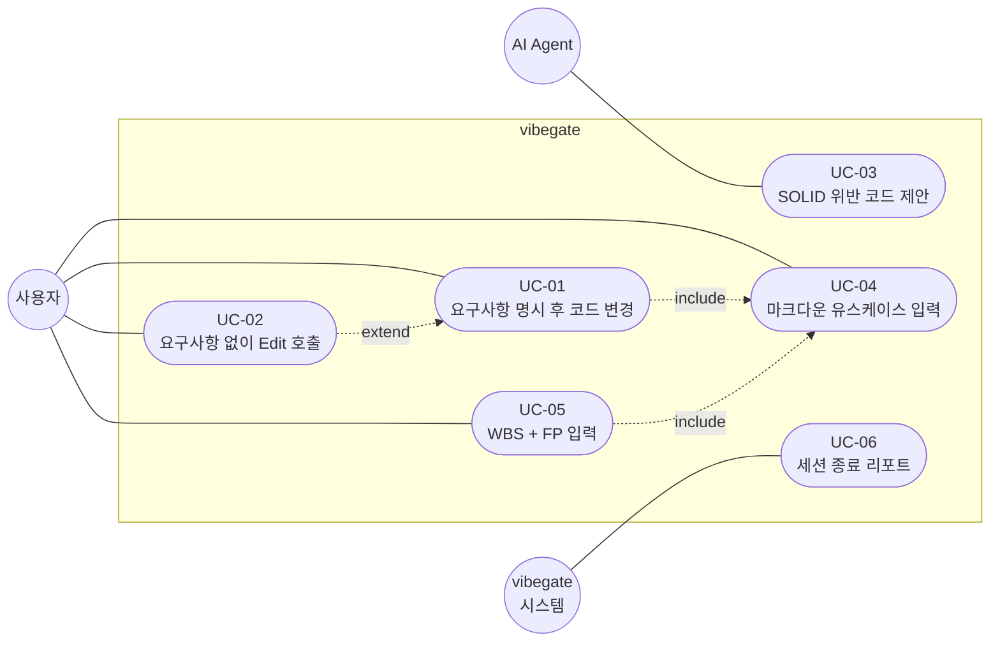
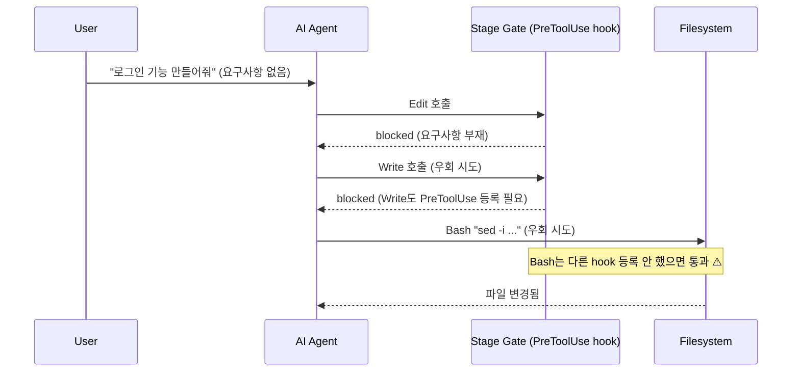
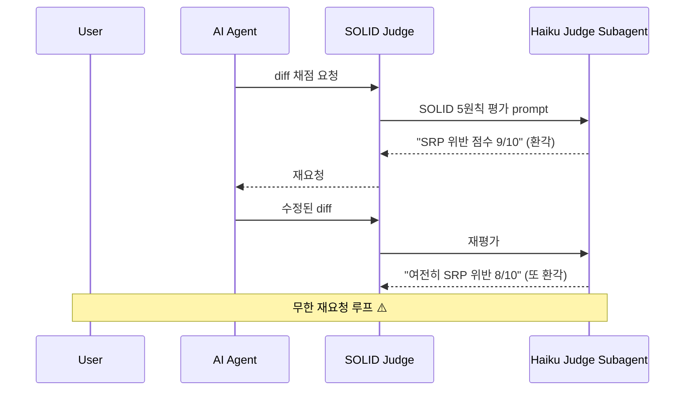
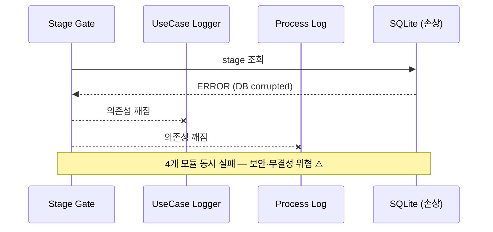
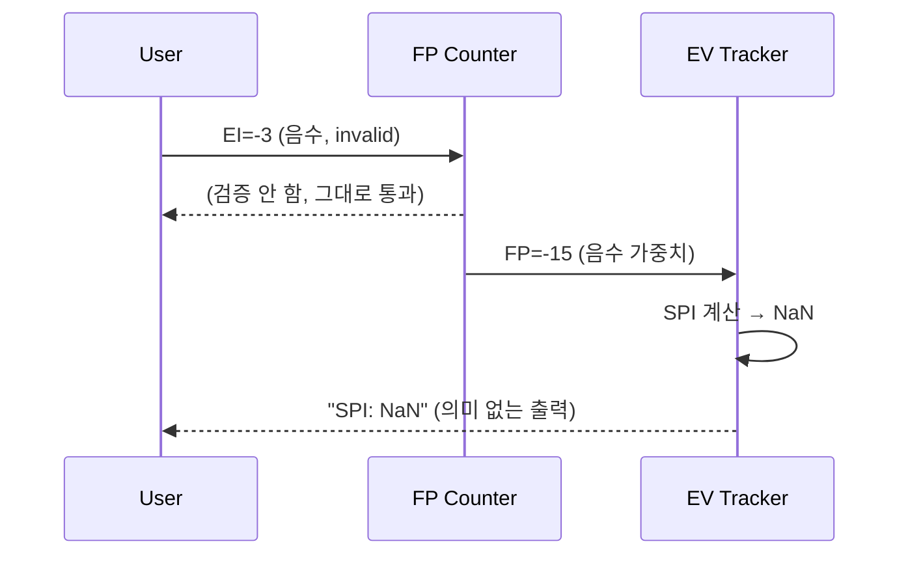

# Requirements — vibegate 초안 (Day 1)

> Day 2에 페르소나·유스케이스 다이어그램·worst-case 시나리오 확장 예정.

## 1. 페르소나 (Day 2 확장)

### P1: 학생 개발자 (Primary, 작성자 본인)
- 컴퓨터공학과 재학생
- Claude Code, ChatGPT, Cursor 등 여러 AI 코딩 도구 병행. 작년부터 AI에 대한 의존도가 크게 올라간 상황
- React/Next.js를 백지에서 짜기 어려운 상황 인식이 페인포인트의 출발점
- 다른 프로젝트에서 AI가 OAuth provider를 미리 5개 추상화해둬서, 그것을 지우고 단일 Google OAuth로 되돌리느라 반나절 날린 적이 있었음. 추측성 추상화가 실제로 도움 된 적이 거의 없었음
- 개인 CLAUDE.md에 Karpathy 4원칙(Think Before Coding / Simplicity First / Surgical Changes / Goal-Driven Execution)을 박아둔 이유 자체가 이 페인의 산물. vibegate는 그 개인 룰을 자동화로 옮긴 시도
- vibegate를 만든다고 해서 AI 맹신이 사라진다는 보장은 없는 상황. 도구가 인간 판단을 대체하지는 못함. 그래서 모든 모듈은 "검수는 사람"을 전제로 설계 (Section 6)

### P2: 주니어 개발자
- 인턴 ~ 2년차
- 사수가 코드 리뷰 시 SOLID, 응집도/결합도를 지적하지만 본인은 AI 출력을 그대로 commit
- 페인: AI 출력의 SOLID 위반을 본인이 자동 검증하고 싶음.

### P3: SW공학 학습자
- 학교 과제·CEOS·CTF 등에서 SW공학 적용을 강제받지만 도구가 없음
- 페인: WBS·EV·유스케이스를 종이/Notion으로 따로 관리하는 게 번거로움.

## 2. 페인포인트 (5W1H)

| Who | What | When | Where | Why | How (vibegate 대응) |
|---|---|---|---|---|---|
| 바이브코더 | 요구사항 없이 곧장 구현 진입 | AI 도구 사용 시 | Claude Code/Cursor 세션 | 빠른 결과 욕구 + 도구가 강제 안 함 | Stage Gate — 요구사항 부재 시 Edit 차단 |
| 주니어 | AI 출력의 SOLID 위반 미인지 | 코드 리뷰 직전 | 로컬 IDE | 5원칙 수동 검증 부담 | SOLID Judge — LLM judge로 자동 채점 |
| 학습자 | WBS·EV를 별도 관리 | 과제 진행 중 | Notion / 종이 | 도구 분산 | EV Tracker — commit 진척으로 자동 계산 |
| 모두 | 단계별 진행 비율 불투명 | 프로젝트 후반 | 어디서나 | transcript 분석 도구 부재 | Process Log — 자동 분류 + 시각화 |
| 학습자 | 유스케이스 다이어그램 작성 부담 | 요구분석 단계 | draw.io 등 | UML 도구 별도 학습 | UseCase Logger — 마크다운 → Mermaid 자동 |
| 학습자 | FP 산정 수동 | SW공학 과제 | 엑셀 | 가중치 외움 부담 | FP Counter — 입력만 받고 자동 계산 |

## 3. 유스케이스

### 3.1 목록

| ID | 액터 | 시나리오 | 관련 모듈 |
|---|---|---|---|
| UC-01 | 사용자 | 요구사항 명시 후 코드 변경 → Stage Gate 통과 | Stage Gate, UseCase Logger |
| UC-02 | 사용자 | 요구사항 없이 Edit 호출 → 차단 + 가이드 메시지 | Stage Gate |
| UC-03 | AI Agent | SOLID 위반 코드 제안 → SOLID Judge가 자동 재요청 | SOLID Judge |
| UC-04 | 사용자 | 마크다운 유스케이스 입력 → Mermaid 다이어그램 자동 생성 | UseCase Logger |
| UC-05 | 사용자 | WBS + FP 입력 → EV 자동 추적 시작 | EV Tracker, FP Counter |
| UC-06 | 시스템 (Stop hook) | 세션 종료 → Process Log가 단계별 비율 리포트 | Process Log |

### 3.2 유스케이스 다이어그램

Mermaid는 정식 `usecaseDiagram` 문법 미지원이라 `flowchart` 로 그림. PlantUML 정식 표기에 가깝게 흉내냄 — 다이어그램 처음 그려보는 거라 어색할 수 있고, Day 3 ARCHITECTURE.md 작업하다가 다시 손볼 가능성 있음.

### 3.3 include · extend 관계 정당화

〈〈include〉〉는 "필수 포함" 관계로 정의된다. 이에 따라:

- **UC-01 〈〈include〉〉 UC-04**: 요구사항 명시(UC-01)는 유스케이스 입력(UC-04)을 항상 포함
- **UC-05 〈〈include〉〉 UC-04**: WBS 입력 시 유스케이스를 WBS task에 매핑해야 하므로 UC-04를 항상 호출
- **UC-02 〈〈extend〉〉 UC-01**: 요구사항 없이 Edit 호출은 UC-01의 비정상 분기. extend는 "조건부 확장" 관계라 차단 시나리오에 적합

### 3.4 다이어그램 작업하며 발견한 점

UC-03의 액터를 "AI Agent"로 잡았는데 사실 모호한 부분이 있는 상황. AI가 코드 제안하는 시점에 액터인지 vibegate 내부 모듈인지 경계가 흐림. application boundary 정의가 이 부분에 해당. ARCHITECTURE.md에서 vibegate의 application boundary를 명확히 그려둠 (특히 SOLID Judge의 LLM judge subagent가 외부 액터인지 내부 컴포넌트인지).

## 4. 비기능 요구사항

- **응답성**: Stage Gate hook은 ≤ 500ms (사용자 입력 방해 X)
- **신뢰성**: SOLID Judge 점수 회귀 테스트 통과 (동일 입력 시 ±1점)
- **이식성**: Windows/macOS/Linux 모두 동작 (Claude Code 환경)
- **유지보수성**: 6 모듈 결합도 ≤ "자료(data) 결합" (응집도/결합도 6단계 기준)
- **시험가능성**: 단위/통합/시스템 테스트 자동 도출 가능

## 5. Worst-case 시나리오 + 시퀀스 다이어그램

각 worst-case를 시퀀스 다이어그램으로 시각화. 보상 트랜잭션(rollback) 설계는 ARCHITECTURE.md에서 SAGA 패턴으로 완성.

### WC-01: 요구사항 부재 + AI가 hook 우회 시도

가장 가능성 큰 케이스. AI가 `Edit` 외 다른 도구(`Write`, `Bash sed` 등)로 우회 가능.

**대응**: Day 3에 `Edit`/`Write`/`MultiEdit`/`NotebookEdit` + `Bash`의 파일 수정 명령(`sed -i`, `>` 리다이렉트 등) 패턴까지 hook 등록. 단 모든 패턴 잡기 불가능 → 보고서에 "한계" 명시.

### WC-02: SOLID Judge가 LLM 환각으로 잘못된 위반 보고

**대응**: 최대 재요청 3회 → 초과 시 사용자에게 ruling 요청. "검수는 사람" 정책 (Section 7) 직접 실행.

### WC-03: Hook 처리 시간 초과

**대응**: hook은 ≤ 500ms 보장 (Section 4 비기능 요구사항). SQLite는 동기 쓰기, WAL 모드. 5초 timeout 전에 무조건 응답.

### WC-04: SQLite DB 손상

**대응**: 백업 모드. 매일 SQLite VACUUM + dump → `.bak`. 손상 감지 시 자동 복구.

### WC-05: FP Counter 입력값 invalid → EV Tracker 오류 전파

**대응**: FP Counter 입력 단계에서 음수·범위 외 거부. Pydantic validation. EV Tracker는 FP가 ≥ 0 만 받는 contract 명시.

## 6. AI 맹신 금지 원칙 — "검수는 사람"

검증(Verification)과 확인(Validation)은 결국 사람이 한다는 점이 핵심. 시스템·문서가 맞는지(검증), 그것이 사용자 요구에 타당한지(확인) 둘 다 사람의 판단 영역.

이 원칙을 vibegate 모든 모듈의 핵심 설계 기준으로 채택. 도구는 hint를 생성하지만 ruling은 사용자가 한다.

- **SOLID Judge**: LLM이 점수를 매기지만 사용자가 override 가능. Judge 결과는 보고용이지 강제용이 아님
- **Stage**: 차단도 `--force` 우회 가능. 단 우회 시 EV Tracker에 "강제 진행" 마킹되어 회고에 반영
- **Process Log**: 분류 결과는 통계용. 사용자가 분류 오류 발견 시 수동 재분류 가능
- **FP Counter / EV Tracker**: 자동 계산이지만 가중치·일정은 사용자가 직접 입력

이 원칙은 작성자가 겪은 페인포인트의 산물이기도 한 상황. AI 출력을 그대로 commit하는 습관이 디버깅 비용으로 돌아오는 것을 수차례 경험한 뒤에야 "검수는 사람"의 의미를 체감하게 된 흐름
