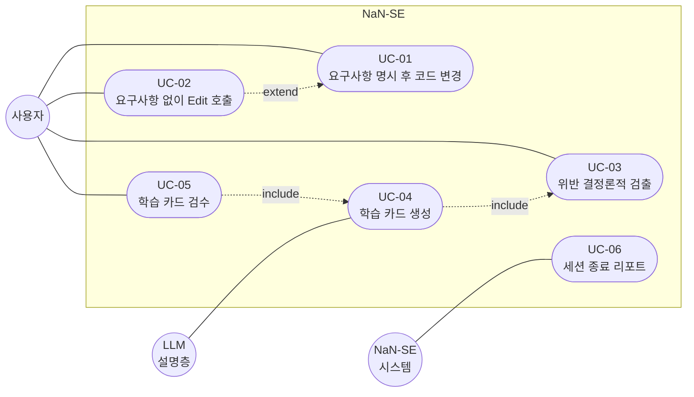
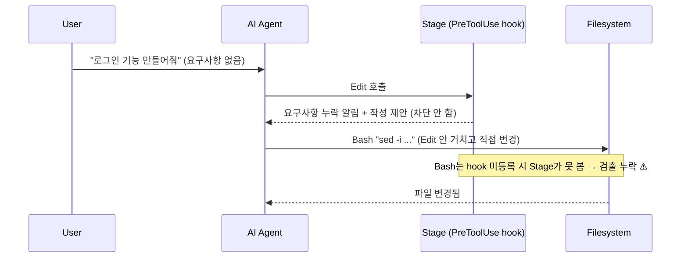
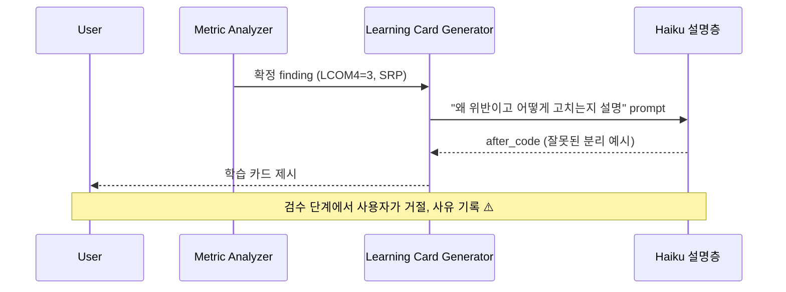
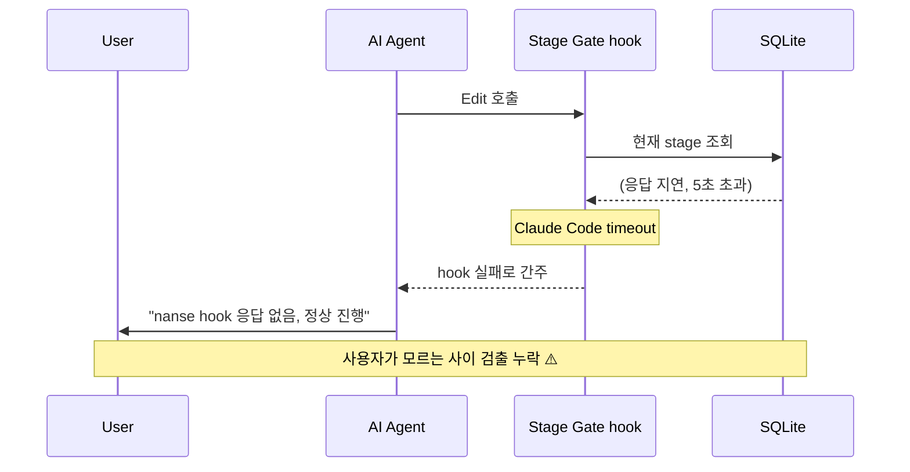
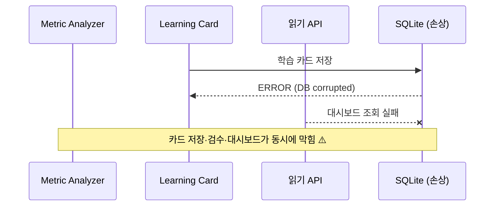
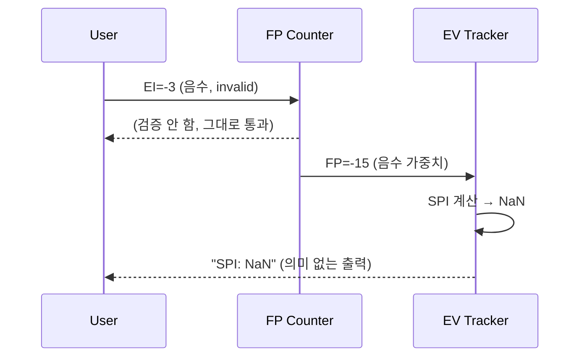

# Requirements — NaN-SE

> Day 1 초안에서 출발. Day 5에 설계 피벗을 반영해 유스케이스와 worst-case를 다시 정리했다.
>
> **피벗 요약**: 검출은 결정론적 정적 메트릭(LCOM4, 순환복잡도)으로만 하고 LLM은 점수를 매기지 않는다. LLM은 확정된 위반을 학습 카드로 설명만 한다. 점수 매기기를 LLM에 맡기면 신뢰할 수 없다는 판단("Are We SOLID Yet?" 결과)에서 나온 결정이다. 자세한 경위는 DISCUSSION_LOG.md Day 5 참조.
>
> **구현 범위**: Metric Analyzer(검출)와 Learning Card(설명·검수)를 실제 구현한다. Traceability는 최소 구현(요구↔코드↔테스트 존재 검증 매트릭스, `nanse trace`)까지만 두고, 전체 자동 갱신은 미구현이다. Stage는 설계만 하고 코드는 두지 않는다(원래부터 차단이 아니라 누락 검출·제안 방식 설계). EV/FP/Process Log도 보고서에서 설계만 언급한다.

## 1. 페르소나 (Day 2 확장)

### P1: 학생 개발자 (Primary, 작성자 본인)
- 컴퓨터공학과 재학생
- Claude Code, ChatGPT, Cursor 등 여러 AI 코딩 도구 병행. 작년부터 AI 의존도가 크게 올랐다
- React/Next.js를 백지에서 짜기 어려운 상황 인식이 페인포인트의 출발점
- 다른 프로젝트에서 AI가 OAuth provider를 미리 5개 추상화해둬서, 그것을 지우고 단일 Google OAuth로 되돌리느라 반나절 날린 적이 있었음. 추측성 추상화가 실제로 도움 된 적이 거의 없었음
- 개인 CLAUDE.md에 Karpathy 4원칙(Think Before Coding / Simplicity First / Surgical Changes / Goal-Driven Execution)을 박아둔 이유 자체가 이 페인의 산물. NaN-SE는 그 개인 룰을 자동화로 옮긴 시도
- NaN-SE를 만든다고 해서 AI 맹신이 사라진다는 보장은 없다. 도구가 사람 판단을 대신하지는 못한다. 그래서 모든 모듈은 "검수는 사람"을 전제로 설계했다 (Section 6)

### P2: 주니어 개발자
- 인턴 ~ 2년차
- 사수가 코드 리뷰 시 SOLID, 응집도/결합도를 지적하지만 본인은 AI 출력을 그대로 commit
- 페인: AI 출력의 SOLID 위반을 본인이 자동 검증하고 싶음.

### P3: SW공학 학습자
- 학교 과제·CEOS·CTF 등에서 SW공학 적용을 강제받지만 도구가 없음
- 페인: WBS·EV·유스케이스를 종이/Notion으로 따로 관리하는 게 번거로움.

## 2. 페인포인트 (5W1H)

| Who | What | When | Where | Why | How (NaN-SE 대응) |
|---|---|---|---|---|---|
| 바이브코더 | 요구사항 없이 곧장 구현 진입 | AI 도구 사용 시 | Claude Code/Cursor 세션 | 빠른 결과 욕구 + 도구가 강제 안 함 | Stage(설계만): 요구사항 누락 검출 + 작성 제안, 차단하지 않음 |
| 주니어 | AI 출력의 SRP·응집도 위반 미인지 | 코드 리뷰 직전 | 로컬 IDE | 5원칙 수동 검증 부담 | Metric Analyzer(구현): LCOM4·순환복잡도로 결정론적 검출 |
| 주니어 | 위반은 알아도 왜·어떻게 고칠지 막막 | 검출 직후 | 로컬 IDE | 원칙을 코드에 적용하는 법 미숙 | Learning Card(구현): 확정 위반을 LLM이 설명, 사용자가 검수 |
| 학습자 | WBS·EV를 별도 관리 | 과제 진행 중 | Notion / 종이 | 도구 분산 | EV Tracker(보고서 설계만): commit 진척으로 자동 계산 |
| 모두 | 단계별 진행 비율 불투명 | 프로젝트 후반 | 어디서나 | transcript 분석 도구 부재 | Process Log(보고서 설계만): 자동 분류 + 시각화 |
| 학습자 | FP 산정 수동 | SW공학 과제 | 엑셀 | 가중치 외움 부담 | FP Counter(보고서 설계만): 입력만 받고 자동 계산 |

## 3. 유스케이스

### 3.1 목록

실제 구현한 UC-03/04/05가 NaN-SE의 핵심 흐름이다. UC-01/02는 설계만, UC-06도 설계만 한다.

| ID | 액터 | 시나리오 | 관련 모듈 | 범위 |
|---|---|---|---|---|
| UC-01 | 사용자 | 요구사항 명시 후 코드 변경, Stage가 누락 없음 확인 | Stage | 설계만 |
| UC-02 | 사용자 | 요구사항 없이 Edit 호출, Stage가 누락 알림 + 작성 제안(차단 안 함) | Stage | 설계만 |
| UC-03 | 사용자 | AI 출력 코드를 분석, Metric Analyzer가 SRP·응집도 위반을 결정론적으로 검출 | Metric Analyzer | 구현 |
| UC-04 | 사용자 | 확정된 위반 finding을 Learning Card로 생성, LLM이 이유·비용·교정 예시를 설명 | Learning Card | 구현 |
| UC-05 | 사용자 | 학습 카드를 검수해 채택/거절, 채택 시 AI에 보낼 재요청 prompt 확보 | Learning Card | 구현 |
| UC-06 | 시스템 (Stop hook) | 세션 종료, Process Log가 단계별 비율 리포트 | Process Log | 보고서 설계만 |

### 3.2 유스케이스 다이어그램

Mermaid는 정식 `usecaseDiagram` 문법을 지원하지 않아 `flowchart`로 그렸다. PlantUML 표기에 가깝게 흉내냈다. 검출에서 학습 카드까지의 핵심 흐름(UC-03, 04, 05)을 굵게 둔다.

### 3.3 include · extend 관계 정당화

〈〈include〉〉는 "필수 포함" 관계로 정의된다. 이에 따라:

- **UC-04 〈〈include〉〉 UC-03**: 학습 카드 생성(UC-04)은 결정론적 검출(UC-03)이 만든 확정 finding을 항상 입력으로 받는다. 검출 없이는 설명할 대상이 없다
- **UC-05 〈〈include〉〉 UC-04**: 검수(UC-05)는 생성된 카드(UC-04)를 항상 전제로 한다
- **UC-02 〈〈extend〉〉 UC-01**: 요구사항 없이 Edit 호출은 UC-01의 비정상 분기. extend는 "조건부 확장" 관계라 누락 알림·제안 분기에 적합

### 3.4 액터 경계에서 정리한 점

피벗 전에는 UC-03의 액터를 "AI Agent"로 잡고 SOLID Judge가 LLM으로 점수를 매기는 구조였다. 이때 LLM이 외부 액터인지 내부 컴포넌트인지 경계가 흐렸다. 피벗 후 검출은 결정론적 정적 분석이라 LLM이 빠졌고, 검출 트리거 액터는 사용자로 분명해졌다. LLM은 UC-04의 설명 생성에만 관여하는 외부 의존성으로 경계가 정리됐다. application boundary는 ARCHITECTURE.md에 그려둔다.

## 4. 비기능 요구사항

- **응답성**: Stage Gate hook은 ≤ 500ms (사용자 입력 방해 X)
- **신뢰성**: Metric Analyzer는 결정론적이라 동일 입력에 동일 출력. 회귀 테스트로 LCOM4·순환복잡도 값이 정확히 재현되는지 검증
- **이식성**: Windows/macOS/Linux 모두 동작 (Claude Code 환경)
- **유지보수성**: 6 모듈 결합도 ≤ "자료(data) 결합" (응집도/결합도 6단계 기준)
- **시험가능성**: 단위/통합/시스템 테스트 자동 도출 가능

## 5. Worst-case 시나리오 + 시퀀스 다이어그램

각 worst-case를 시퀀스 다이어그램으로 시각화했다. 단계 실패 시 되돌림을 보상 트랜잭션 개념에 빗대 정리했는데, 분산 트랜잭션 SAGA의 직접 적용은 아니고 발상만 빌린 설계 수준의 비유다(ARCHITECTURE.md 1절).

### WC-01: 요구사항 부재 + Stage가 변경을 못 보는 경우

(Stage는 설계만 한 모듈이라, 아래는 hook 연동을 가정한 설계 단계 리스크 분석이다.) Stage는 차단하지 않고 누락을 알릴 뿐이라, 위험은 "우회"가 아니라 hook이 변경 자체를 못 봐서 알림 기회를 놓치는 것이다. AI가 `Edit` 대신 `Bash sed` 같은 경로로 파일을 바꾸면 PreToolUse가 안 걸려 검출이 누락된다.

**대응(설계)**: `Edit`/`Write`/`MultiEdit`/`NotebookEdit` + `Bash`의 파일 수정 명령(`sed -i`, `>` 리다이렉트 등) 패턴까지 hook을 등록하는 방향. 단 모든 경로를 잡는 건 불가능하므로 보고서에 "한계"로 명시한다.

### WC-02: LLM 설명층이 잘못된 교정 예시를 생성

피벗으로 검출은 결정론적이 됐다. 같은 코드는 항상 같은 LCOM4·순환복잡도를 내므로 검출 단계에는 환각이 없다. 위험은 설명층으로 옮겨갔다. 학습 카드의 after_code나 revision_prompt를 LLM이 만드는데, 이게 틀린 리팩토링을 제시할 수 있다.

**대응**: 점수는 결정론적 메트릭이 매기므로 환각으로 잘못 검출되는 일은 없다. 설명의 품질은 사용자 검수(UC-05)로 거른다. 거절 시 사유를 기록해 다음 카드 prompt 개선에 반영한다. "검수는 사람" 정책(Section 6)의 직접 실행 지점이다.

### WC-03: Hook 처리 시간 초과

**대응**: hook은 ≤ 500ms 보장 (Section 4 비기능 요구사항). SQLite는 동기 쓰기, WAL 모드. 5초 timeout 전에 무조건 응답.

### WC-04: SQLite DB 손상

**대응**: 백업 모드. 매일 SQLite VACUUM + dump → `.bak`. 손상 감지 시 자동 복구.

### WC-05: FP Counter 입력값 invalid → EV Tracker 오류 전파

**대응**: FP Counter 입력 단계에서 음수·범위 외 거부. Pydantic validation. EV Tracker는 FP가 ≥ 0 만 받는 contract 명시.

## 6. AI 맹신 금지 원칙 — "검수는 사람"

검증(Verification)과 확인(Validation)은 결국 사람이 한다는 점이 핵심. 시스템·문서가 맞는지(검증), 그것이 사용자 요구에 타당한지(확인) 둘 다 결국 사람이 판단한다.

이 원칙을 NaN-SE 모든 모듈의 핵심 설계 기준으로 채택. 도구는 hint를 생성하지만 ruling은 사용자가 한다.

- **Metric Analyzer / Learning Card**: 검출은 결정론적이지만 위반을 고칠지는 사용자가 정한다. 학습 카드의 교정 예시도 사용자가 채택/거절한다. 카드는 보고용이지 강제용이 아님
- **Stage**: 차단하지 않고 누락 알림·제안만. 제안을 받아들일지는 사용자가 정한다
- **Process Log**: 분류 결과는 통계용. 사용자가 분류 오류 발견 시 수동 재분류 가능
- **FP Counter / EV Tracker**: 자동 계산이지만 가중치·일정은 사용자가 직접 입력

이 원칙은 작성자가 겪은 페인포인트의 산물이기도 하다. AI 출력을 그대로 commit하는 습관이 디버깅 비용으로 돌아오는 일을 여러 번 겪은 뒤에야 "검수는 사람"의 의미를 체감했다.
